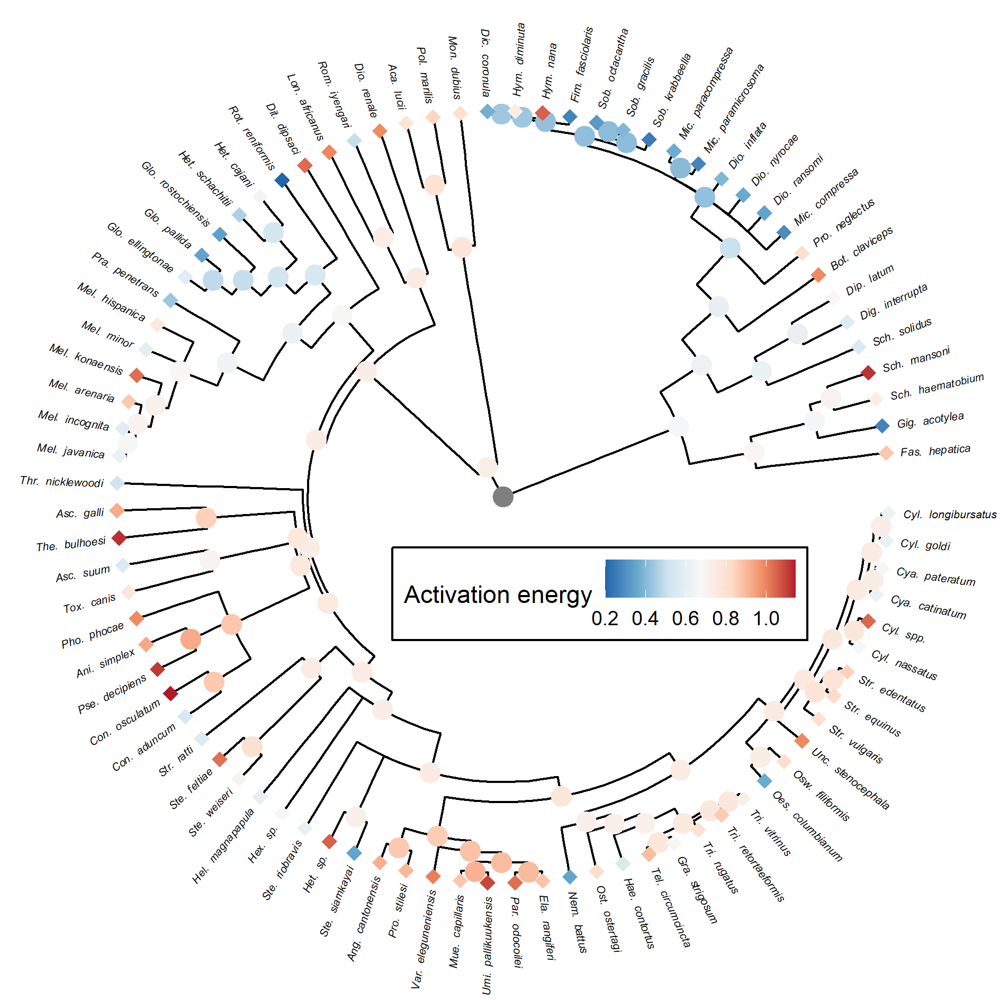

# Analysis of helminth activation energies

This repo includes [data](data/200421_ArrDevFits_filter.csv) and R scripts for analyzing a compilation of temperature-dependent development rates in parasitic worms (helminths). We compiled studies from the literature examining how helminth developmental rate changes with temperature. This change was quantified as an activation energy, representing whether development is weakly or strongly temperature dependent (low or high AE, respectively). We then explored various possible factors that may influence helminth temperature sensitivity, like parasite phylogeny, thermal niche, and host characteristics. Our main analysis can be found [here](analyses/10_analysis_devo_May2020.md).

One of our main findings was that related parasites had similar temperature sensitivity (see figure). Such phylogenetic conservatism may facilitate predicting how temperature change affects the development of helminth species for which empirical data are lacking or difficult to obtain.

# Reference

Jessica Ann Phillips, Juan S. Vargas Soto, Samraat Pawar, Janet Koprivnikar, Daniel P.  Benesh, Péter K. Molnár. 2021. The effects of phylogeny, habitat, and host characteristics on the thermal sensitivity of helminth development. Proc. Royal Soc. B. In revision.
