Determinants of helminth activation energy (Arrhenius)
================
Dan Benesh
November 4, 2019

The purpose of this notebook is to explore and model the activation
energies for helminth development. I specifically use activation
energies fit with the **Arrhenius** model.

# Get data organized

First, I get the data organized for modelling. From the table of curve
fits, I take the **Arrhenius** activation energies and add them to the
table including the predictors.

How many AE estimates are there?

    ## [1] 142

How many unique species are in the data?

    ## [1] 88

So there are a fair number of species with multiple curves.

### Look at the response - activation energy

What is the distribution of activation energies?

<!-- -->

The median activation energy was 0.65.

How confident are we in each activation energy estimate? For this, we
look at the distribution of standard error estimates for the activation
energies. Most are small, but there is an outlier.

<!-- -->

All else equal, we should have more confidence in curves fit with a
larger number of temperatures. To reflect this, standard error should
decrease with sample size (i.e. number of temperatures). But this is not
obvious when we plot standard error as a function of temperatures.

<!-- -->

When we zoom in to exclude the outlier, there is still not a clear
relationship between standard error and the number of temperatures.
However, the largest standard errors are observed with the lowest sample
sizes (left-hand part of plot), which is reassuring.

<!-- -->

With less precision (higher standard errors), we would expect a broader
distribution of activation energy estimates. Let’s look at the
distribution of activation energies split by whether standard error was
high or low (above or below the median SE). Surprisingly, the estimates
with lower standard errors have a broader distribution, opposite to
expectations.

<!-- -->

The median of the distribution also seems to vary with standard error;
high standard error is associated with higher activation energy.

    ## # A tibble: 2 x 2
    ##   se_cat              median_AE
    ##   <chr>                   <dbl>
    ## 1 high standard error     0.721
    ## 2 low standard error      0.574

Thus, when we weight the data points by the standard error of the
activation energies, it should shift the overall mean down.

How many AE estimates per species?

    ##    binomial               n        
    ##  Length:87          Min.   :1.000  
    ##  Class :character   1st Qu.:1.000  
    ##  Mode  :character   Median :1.000  
    ##                     Mean   :1.632  
    ##                     3rd Qu.:2.000  
    ##                     Max.   :8.000

Usually just one, but up to 8. For visualizing, I’ll randomly take one
AE per species.

This reduces the data from n = 142 to n = 87.

Make a plot of the distribution of activation energy across the tree.

<!-- -->

The bars on the right are the estimated activation energies. Maybe some
clades at the top (nematodes) have higher values than those at the
bottom (flatworms), but it is not conspicuous. I don’t think that is
super surprising, because I assume AE is a parameter that is subject to
a fair amount of measurement error.

# Phylogenetic mixed models

I’ll fit phylogenetic mixed models (see
[here](https://onlinelibrary.wiley.com/doi/full/10.1111/j.1420-9101.2009.01915.x)
for an overview of these models) using the `MCMCglmm` library. These are
not simple models, but the Bayesian `MCMCglmm` package does allow us to
fit both within- and between-species effects in the same model. It also
allows us to weight the activation energies by their standard errors.

Before diving into the models, though, let’s outline a model-building
strategy. First, I fit a ‘base’ model with the tangential variables.
Here, I would include phylogeny and within-species variation. From the
outset, I weight each data point by the standard error of activation
energy. This weight was incorporated into the model as suggested
[here](https://ourcodingclub.github.io/2018/01/22/mcmcglmm.html) and in
the `MCMCglmm` course notes. Second, I add biologically interesting
variables to this base model. Here, I would categorize interesting
variables into two groups: (1) characteristics of the external
environment (like latitude, aquatic vs terrestrial, etc.) and (2)
characteristics of the parasite (e.g. in or out of host, stage in the
life cycle, etc.). With this as a plan, let’s get modelling.

### Within-species effect

First, I create a null model that includes a parasite species random
effect, but not a phylogenetic effect. Throughout, data points are
weighted by their standard error.

After fitting an MCMC model, a first quality check is looking at chain
mixing. Essentially, we want the chain to bounce back and forth randomly
- it shouldn’t get stuck at particular parameter estimates.

<!-- -->

The within-species effect, `binomial`, mixes well and is non-zero,
suggesting that multiple AE measurements on the same species tend to be
similar. The variance component for `std-error` is fixed at 1, such that
the weights assigned do not change as the posterior distribution is
sampled by the Markov chain.

The model intercept (the average activation energy) is about 0.66

    ## 
    ##  Iterations = 3001:22991
    ##  Thinning interval  = 10
    ##  Sample size  = 2000 
    ## 
    ##  DIC: -27.72248 
    ## 
    ##  G-structure:  ~binomial
    ## 
    ##          post.mean l-95% CI u-95% CI eff.samp
    ## binomial   0.04283  0.02348  0.06474     2000
    ## 
    ##                ~idh(stderr_arr):units
    ## 
    ##                  post.mean l-95% CI u-95% CI eff.samp
    ## stderr_arr.units         1        1        1        0
    ## 
    ##  R-structure:  ~units
    ## 
    ##       post.mean l-95% CI u-95% CI eff.samp
    ## units   0.03161  0.02056  0.04411     1857
    ## 
    ##  Location effects: E_Arr ~ 1 
    ## 
    ##             post.mean l-95% CI u-95% CI eff.samp  pMCMC    
    ## (Intercept)    0.6588   0.6033   0.7169     1869 <5e-04 ***
    ## ---
    ## Signif. codes:  0 '***' 0.001 '**' 0.01 '*' 0.05 '.' 0.1 ' ' 1

Here’s the proportion of variation attributable to the within-species
effect.

    ## [1] 0.5769698

It is high. On the one hand this makes sense, as many species only had a
single measurement (and hence no residual value after accounting for a
‘species effect’). Here’s an attempt to visualize the variation in
activation energy estimates for the species that had multiple
measurements. The species are ordered by their median activation energy.
One can see that some species tend to have very similar measurements,
while for other species, there is a fair amount of spread in the
estimated activation energies.

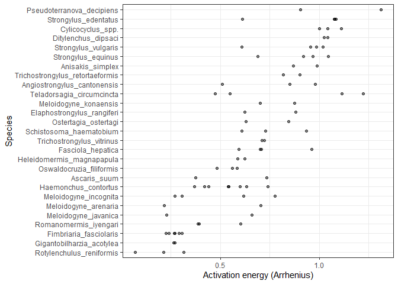<!-- -->

### Phylogenetic effect

Now, let’s add phylogenetic effects to this mixed model. To do this, we
create the phylogenetic covariance matrix and then include this as a
random effect.

For this model, the chain needs to be run for longer to get reasonable
mixing, partly because the two random effects are related. If the model
estimates higher values for the within-species variance component, it
estimates less for the phylogenetic component, and vice versa.

After fitting, we can again plot the chains. They look good. The
within-species effect (`binomial`) is smaller than the phylogenetic
effect (`tree_tips`).

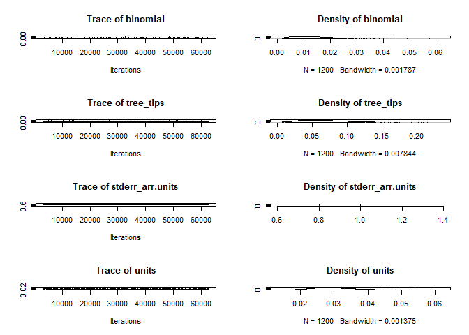<!-- -->

These results suggest that phylogenetically related species tend to have
similar AEs, and when a species is measured multiple times, the
estimated AEs are similar, though they are not far more similar than
what they are expected to be based on phylogeny (i.e. the within-species
effect does not explain much additional variation beyond phylogeny).

The phylogenetic effect is strong. It explained 60% of the variation in
AE.

By contrast, the ‘species’ effect explained 11% of the variation.

Here’s a plot splitting AE by parasite order. It does look like some
clades tend to have higher or lower AEs.

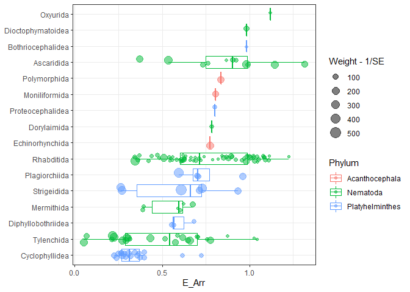<!-- -->

### Environmental variables

Now, we move onto environmental variables of interest, though it is
important to keep phylogenetic effects in mind during this modeling
exercies. Essentially, any explanatory variable that is phylogenetically
structured will “compete” with the phylogenetic random effect to explain
variation in AE.

I have tried to find a series of logical steps to testing environmental
correlates of helminth AE. First and foremost, we expect AE to be
related to environmental temperature, so I start with temperature
variables.

#### Mean temperature

There are three temperature measurements in the data: mean, max, and min
for the location. I would expect the three temp variables to be tightly
correlated, so let’s start by just adding the mean to the model. Note
that I have centered the continuous variables around their median, such
that the model parameters are estimated at e.g. the data’s median annual
temperature.

The effect of mean locale temperature is negative and significant.

    ## 
    ##  Iterations = 3001:62951
    ##  Thinning interval  = 50
    ##  Sample size  = 1200 
    ## 
    ##  DIC: -47.26704 
    ## 
    ##  G-structure:  ~binomial
    ## 
    ##          post.mean l-95% CI u-95% CI eff.samp
    ## binomial   0.01342 0.003396  0.02738     1064
    ## 
    ##                ~tree_tips
    ## 
    ##           post.mean l-95% CI u-95% CI eff.samp
    ## tree_tips   0.05368  0.01196    0.109     1074
    ## 
    ##                ~idh(stderr_arr):units
    ## 
    ##                  post.mean l-95% CI u-95% CI eff.samp
    ## stderr_arr.units         1        1        1        0
    ## 
    ##  R-structure:  ~units
    ## 
    ##       post.mean l-95% CI u-95% CI eff.samp
    ## units     0.029  0.02029  0.03998     1200
    ## 
    ##  Location effects: E_Arr ~ mean_ann_temp_cen 
    ## 
    ##                   post.mean  l-95% CI  u-95% CI eff.samp   pMCMC    
    ## (Intercept)        0.683708  0.446133  0.923915     1200 < 8e-04 ***
    ## mean_ann_temp_cen -0.008610 -0.015748 -0.002332     1321 0.00833 ** 
    ## ---
    ## Signif. codes:  0 '***' 0.001 '**' 0.01 '*' 0.05 '.' 0.1 ' ' 1

For species living at lower temperatures, development speeds up more as
temperature increases. It also does not look like this depends on
whether an exact study location was given.

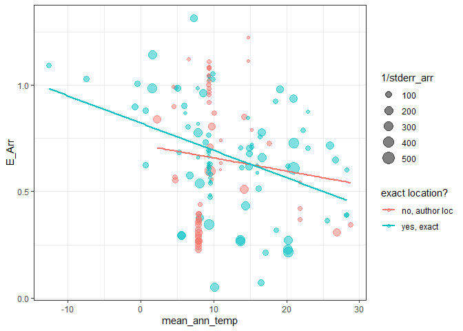<!-- -->

#### Temperature variation

A mean temperature does not indicate the temperature range a parasite is
exposed to. Thus, as the next modelling step, we’ll include location min
and max temps. None of these terms are significant, though the model DIC
decreases, suggesting together they explain some variation.

    ## 
    ##  Iterations = 3001:62951
    ##  Thinning interval  = 50
    ##  Sample size  = 1200 
    ## 
    ##  DIC: -52.0785 
    ## 
    ##  G-structure:  ~binomial
    ## 
    ##          post.mean l-95% CI u-95% CI eff.samp
    ## binomial   0.01559 0.003416  0.02979     1200
    ## 
    ##                ~tree_tips
    ## 
    ##           post.mean l-95% CI u-95% CI eff.samp
    ## tree_tips   0.06007   0.0132   0.1277    964.4
    ## 
    ##                ~idh(stderr_arr):units
    ## 
    ##                  post.mean l-95% CI u-95% CI eff.samp
    ## stderr_arr.units         1        1        1        0
    ## 
    ##  R-structure:  ~units
    ## 
    ##       post.mean l-95% CI u-95% CI eff.samp
    ## units   0.02723  0.01757  0.03843     1200
    ## 
    ##  Location effects: E_Arr ~ mean_ann_temp_cen + max_month_temp_cen + min_month_temp_cen 
    ## 
    ##                    post.mean l-95% CI u-95% CI eff.samp  pMCMC    
    ## (Intercept)          0.73493  0.46741  1.00952     1445 <8e-04 ***
    ## mean_ann_temp_cen   -0.04018 -0.10505  0.02256     1200  0.230    
    ## max_month_temp_cen   0.02198 -0.01523  0.06284     1200  0.270    
    ## min_month_temp_cen   0.01363 -0.01776  0.04423     1200  0.388    
    ## ---
    ## Signif. codes:  0 '***' 0.001 '**' 0.01 '*' 0.05 '.' 0.1 ' ' 1

Interestingly, the parameter estimates for max and min temps are
positive, which is opposite to the trend seen with mean temp. But when
we plot AE as a function of max and min, we see a negative relationship
just like for mean temp: low temps, high AE.

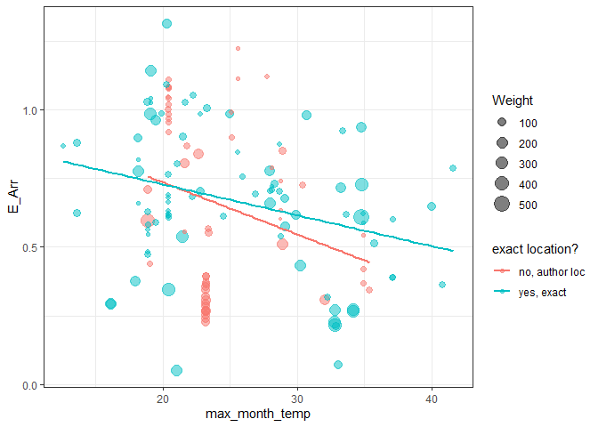<!-- -->

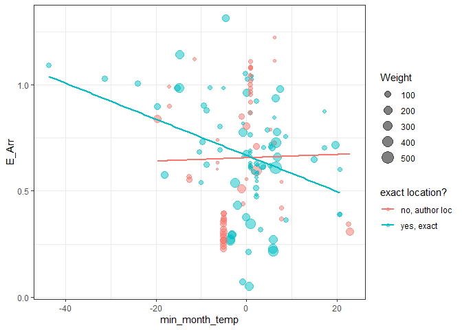<!-- -->

This is suggestive that, once controlling for mean temp, activation
energies increase with higher max and min temps. Let’s see if we can
uncover this pattern in the data. We’ll take the residuals from the
previous model, which just included mean temperature, and plot them
again max and min temp.

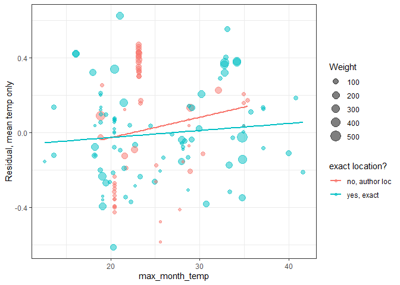<!-- -->
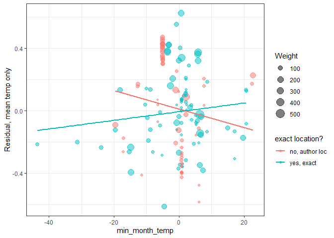<!-- -->

We uncover the positive relationships, but they are clearly weak. Thus,
we are in a situation when one metric (DIC) suggests adding `max` and
`min` temps improve the model, while other metrics, like p-values and
plots do not indicate strong relationships. In cases like this, we need
to decide if there is a good biological reason to include extreme temps,
even if their effects are ambiguous. On the one hand, we could expect
that temperature variability affects activation energy. On the other
hand, a lower min temperature might not matter much if parasites do not
develop below a certain threshold that is unlinked to the minimum
temperature. Also, if temperature variability is what drives activation
energy, then we would expect the parameter estimates for min and max to
go in opposite directions, i.e. larger temperature extremes are
associated with higher (or lower) AE values. Since (i) these results are
ambiguous, (ii) they are confounded with mean temperature, and (iii) we
test several other proxies of seasonality/temperature variability, my
preference is to drop min and max temp from the model.

#### Seasonality

Variation in temperature is one component of seasonality, but not the
only one. Season length, photoperiod, rainfall, etc. may all vary with
seasons and perhaps impact the thermal-dependence of parasite
development. The dataset contains two variables that might capture
seasonality: latitude and distribution. Distribution zones were defined
as ‘tropics’, ‘temperate’, ‘polar’, etc., which means this variable
overlaps substantially with latitude. Consequently, I examine these two
variables in parallel (i.e. I won’t put both in the same model).

##### Latitude

Let’s look at latitude first, as it is a single continuous variable
while distribution is multiple categories. In some cases, a study gave a
detailed location, so our data contains exact latitudes. In other cases,
no site was given and the author’s location was taken as a rough proxy
of the study’s location. Most records were from the Northern hemisphere,
but a few were from the Southern hemisphere. Thus, I took the absolute
value of latitude, essentially the distance from the equator.

There is a marginal relationship between AE and latitude.

    ## 
    ##  Iterations = 3001:62951
    ##  Thinning interval  = 50
    ##  Sample size  = 1200 
    ## 
    ##  DIC: -47.54474 
    ## 
    ##  G-structure:  ~binomial
    ## 
    ##          post.mean l-95% CI u-95% CI eff.samp
    ## binomial   0.01362 0.003168  0.02702     1038
    ## 
    ##                ~tree_tips
    ## 
    ##           post.mean l-95% CI u-95% CI eff.samp
    ## tree_tips   0.04603  0.01147  0.09731    819.5
    ## 
    ##                ~idh(stderr_arr):units
    ## 
    ##                  post.mean l-95% CI u-95% CI eff.samp
    ## stderr_arr.units         1        1        1        0
    ## 
    ##  R-structure:  ~units
    ## 
    ##       post.mean l-95% CI u-95% CI eff.samp
    ## units   0.02902  0.02001  0.03942     1200
    ## 
    ##  Location effects: E_Arr ~ mean_ann_temp_cen + lat_abs 
    ## 
    ##                   post.mean  l-95% CI  u-95% CI eff.samp  pMCMC    
    ## (Intercept)        1.012662  0.647379  1.357212     1200 <8e-04 ***
    ## mean_ann_temp_cen -0.020241 -0.032747 -0.008539     1200 <8e-04 ***
    ## lat_abs           -0.006954 -0.013079 -0.001196     1227 0.0267 *  
    ## ---
    ## Signif. codes:  0 '***' 0.001 '**' 0.01 '*' 0.05 '.' 0.1 ' ' 1

Surprisingly, the parameter estimate for latitude is negative, but when
we plot it, we see that activation energies tend to increase with
latitude.

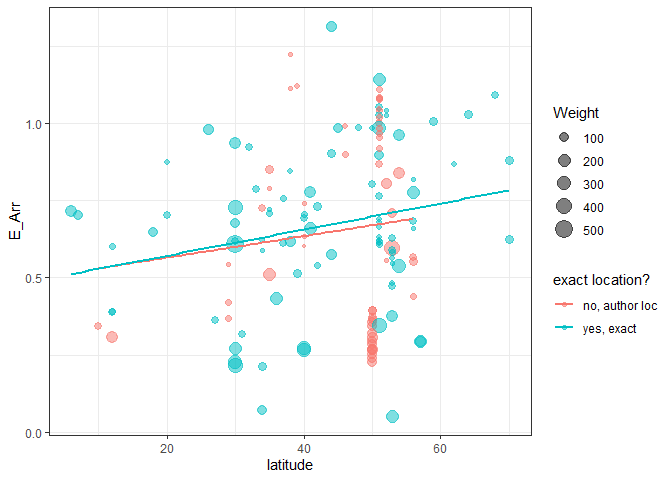<!-- -->

This suggests that, like for `min` and `max` temperature, correlations
among variables (here between mean temp and latitude) might cause
counterintuitive or spurious results. When we remove the effect of mean
temperature on activation energy (i.e. we take the residuals of the
model with just mean temp), and then plot the residual variation as a
function of latitude, we see essentially no relationship between
latitude and activation energy.

<!-- -->

Thus, even though the term was significant, the effect of latitude is
hard to interpret and not an obvious improvement to the model. Let’s
look at the next variable, which is related to latitude.

##### Climate zones

Our latitude variable is not a perfect representation of a parasite’s
‘ancestral’ habitat. Many species in the data are associated with
people or livestock and have thus been moved all around the world. This
is reflected in the distribution zone variable: it contains a category
for parasites with a broad distribution.

However, the distribution categories are still tightly linked to
latitude.

<!-- -->

Nonetheless, let’s add this variable to the model instead of latitude.

Most of the contrasts among these categories are not significant.

    ## 
    ##  Iterations = 3001:62951
    ##  Thinning interval  = 50
    ##  Sample size  = 1200 
    ## 
    ##  DIC: -48.08072 
    ## 
    ##  G-structure:  ~binomial
    ## 
    ##          post.mean l-95% CI u-95% CI eff.samp
    ## binomial   0.01591  0.00375  0.02975     1042
    ## 
    ##                ~tree_tips
    ## 
    ##           post.mean l-95% CI u-95% CI eff.samp
    ## tree_tips   0.04397 0.004902  0.09404    920.1
    ## 
    ##                ~idh(stderr_arr):units
    ## 
    ##                  post.mean l-95% CI u-95% CI eff.samp
    ## stderr_arr.units         1        1        1        0
    ## 
    ##  R-structure:  ~units
    ## 
    ##       post.mean l-95% CI u-95% CI eff.samp
    ## units   0.02809  0.01781  0.03852     1200
    ## 
    ##  Location effects: E_Arr ~ mean_ann_temp_cen + dist_zone 
    ## 
    ##                      post.mean  l-95% CI  u-95% CI eff.samp  pMCMC    
    ## (Intercept)           0.663730  0.414646  0.903509     1200 <8e-04 ***
    ## mean_ann_temp_cen    -0.014635 -0.023810 -0.006094     1200 <8e-04 ***
    ## dist_zonetemperate   -0.054385 -0.232698  0.128966     1200  0.527    
    ## dist_zonesubtropical  0.147465 -0.089667  0.400442     1766  0.247    
    ## dist_zonetropical     0.157368 -0.144473  0.422681     1347  0.278    
    ## dist_zoneglobal       0.062189 -0.113628  0.241392     1200  0.487    
    ## ---
    ## Signif. codes:  0 '***' 0.001 '**' 0.01 '*' 0.05 '.' 0.1 ' ' 1

Consistent with the pattern for temperature and latitude, polar species
tend to have higher AE.

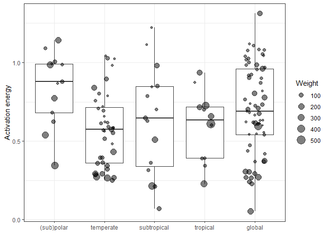<!-- -->

Latitude and distribution overlap and presumably explain the same
variation in AE, but which explains it better? We can compare the models
with latitude vs distribution zone using information criteria. Here is
the progression of model fits thus far (low DIC, better model):

    ## [1] "DIC for model with phylogeny: -44.6"

    ## [1] "DIC for model with just mean temp: -47.3"

    ## [1] "DIC for model with latitude: -47.5"

    ## [1] "DIC for model with distribution zone: -48.1"

According to this measure, the model with distribution is better than
the one with latitude. One explanation for this, is that including
distribution zone strengthens the estimated effect of mean annual
temperature; it explains residual variation around the temp-AE
relationship.

<!-- -->

Thus, I’ll retain distribution in the model as a proxy for seasonality,
but I’ll drop latitude.

#### Habitat - aquatic vs freshwater

As a final environmental variable, we can add parasite habitat: aquatic
vs terrestrial. Water dampens temperature swings, such that seasonality
is less pronounced in aquatic habitats compared to terrestrial ones.
Thus, this variable might modify the effect of seasonality proxies like
distribution zone. (Note: for a couple TPCs, I filled in habitat and
distribution data.)

Adding habitat to the model improves DIC, but the parameter is not
significant.

    ## 
    ##  Iterations = 3001:62951
    ##  Thinning interval  = 50
    ##  Sample size  = 1200 
    ## 
    ##  DIC: -49.42372 
    ## 
    ##  G-structure:  ~binomial
    ## 
    ##          post.mean l-95% CI u-95% CI eff.samp
    ## binomial   0.01474 0.002587  0.02847     1005
    ## 
    ##                ~tree_tips
    ## 
    ##           post.mean l-95% CI u-95% CI eff.samp
    ## tree_tips   0.05477 0.007425   0.1167    829.4
    ## 
    ##                ~idh(stderr_arr):units
    ## 
    ##                  post.mean l-95% CI u-95% CI eff.samp
    ## stderr_arr.units         1        1        1        0
    ## 
    ##  R-structure:  ~units
    ## 
    ##       post.mean l-95% CI u-95% CI eff.samp
    ## units    0.0279  0.01792  0.03873     1200
    ## 
    ##  Location effects: E_Arr ~ mean_ann_temp_cen + dist_zone + habitat_d1 
    ## 
    ##                       post.mean l-95% CI u-95% CI eff.samp   pMCMC   
    ## (Intercept)             0.64218  0.39195  0.94716   1200.0 0.00167 **
    ## mean_ann_temp_cen      -0.01475 -0.02339 -0.00543   1200.0 0.00667 **
    ## dist_zonetemperate     -0.05359 -0.23087  0.12031   1039.8 0.56667   
    ## dist_zonesubtropical    0.14086 -0.09710  0.37388   1200.0 0.25333   
    ## dist_zonetropical       0.16154 -0.12028  0.42169   1200.0 0.25000   
    ## dist_zoneglobal         0.04584 -0.11893  0.22708    821.6 0.63500   
    ## habitat_d1terrestrial   0.07913 -0.12846  0.25748    993.3 0.41833   
    ## ---
    ## Signif. codes:  0 '***' 0.001 '**' 0.01 '*' 0.05 '.' 0.1 ' ' 1

Terrestrial species have higher AE on average than aquatic species
(combines both freshwater and marine species). This plot also
demonstrates how weights (standard errors) reduced the estimated effect
of habitat. The raw difference in AE between habitats was about 0.11,
but the model estimated it to be lower, 0.07.

<!-- -->

We might expect the aquatic - terrestrial dichotomy to be particularly
important in more seasonal locations. That is, there may be an
interaction between our seasonality proxy (distribution) and habitat.
Unfortunately, this cuts the data quite thin, as there are not many
freshwater and terrestrial species in each distribution category.

<!-- -->

When we add this interaction to the model, it is not an improvement.

    ## 
    ##  Iterations = 3001:62951
    ##  Thinning interval  = 50
    ##  Sample size  = 1200 
    ## 
    ##  DIC: -47.80855 
    ## 
    ##  G-structure:  ~binomial
    ## 
    ##          post.mean l-95% CI u-95% CI eff.samp
    ## binomial   0.01519 0.002174  0.02984      949
    ## 
    ##                ~tree_tips
    ## 
    ##           post.mean l-95% CI u-95% CI eff.samp
    ## tree_tips   0.05661 0.004792    0.129    776.2
    ## 
    ##                ~idh(stderr_arr):units
    ## 
    ##                  post.mean l-95% CI u-95% CI eff.samp
    ## stderr_arr.units         1        1        1        0
    ## 
    ##  R-structure:  ~units
    ## 
    ##       post.mean l-95% CI u-95% CI eff.samp
    ## units   0.02782  0.01949   0.0395     1200
    ## 
    ##  Location effects: E_Arr ~ mean_ann_temp + dist_zone * habitat_d1 
    ## 
    ##                                          post.mean  l-95% CI  u-95% CI
    ## (Intercept)                               0.837226  0.493060  1.163947
    ## mean_ann_temp                            -0.015883 -0.025016 -0.007216
    ## dist_zonetemperate                       -0.137059 -0.391894  0.157207
    ## dist_zonesubtropical                      0.209920 -0.042959  0.534642
    ## dist_zonetropical                         0.214635 -0.189269  0.600731
    ## dist_zoneglobal                          -0.028699 -0.334541  0.220330
    ## habitat_d1terrestrial                    -0.025541 -0.350304  0.351125
    ## dist_zonetemperate:habitat_d1terrestrial  0.159842 -0.221856  0.517289
    ## dist_zonetropical:habitat_d1terrestrial  -0.052373 -0.537762  0.442153
    ## dist_zoneglobal:habitat_d1terrestrial     0.142560 -0.217249  0.513922
    ##                                          eff.samp   pMCMC    
    ## (Intercept)                                  1200 < 8e-04 ***
    ## mean_ann_temp                                1200 0.00167 ** 
    ## dist_zonetemperate                           1200 0.32333    
    ## dist_zonesubtropical                         1174 0.13333    
    ## dist_zonetropical                            1200 0.27667    
    ## dist_zoneglobal                              1628 0.83333    
    ## habitat_d1terrestrial                        1444 0.87167    
    ## dist_zonetemperate:habitat_d1terrestrial     1200 0.37667    
    ## dist_zonetropical:habitat_d1terrestrial      1200 0.86667    
    ## dist_zoneglobal:habitat_d1terrestrial        1200 0.45833    
    ## ---
    ## Signif. codes:  0 '***' 0.001 '**' 0.01 '*' 0.05 '.' 0.1 ' ' 1

To summarize, AE tends to be higher with low mean locale temperatures.
This happens at high latitudes, but this effect is not independent of
temperature.

### Host-parasite characteristics

Now, we turn from the environment to variables describing the
host-parasite interaction. I consider a few variables: (1) host type,
(2) stage in or out of host, and (3) target host. Compared to the
environmental variables, these variables are not as obviously
confounded.

#### Plant vs animal parasite

A major dichotomy is between between plant and animal parasites. This
might be relevant if plant and animal hosts have different activation
energies or if they differ in how much they ‘protect’ parasites from
temperature variation.

Distinguishing plants and animals is not significant, though the model
DIC goes down. Plant parasites tend to have lower AE than animal
parasites. Also, I imagine this distinction is strongly conflated with
phylogeny.

    ## 
    ##  Iterations = 3001:62951
    ##  Thinning interval  = 50
    ##  Sample size  = 1200 
    ## 
    ##  DIC: -49.96749 
    ## 
    ##  G-structure:  ~binomial
    ## 
    ##          post.mean l-95% CI u-95% CI eff.samp
    ## binomial   0.01484 0.002644  0.02885    941.7
    ## 
    ##                ~tree_tips
    ## 
    ##           post.mean l-95% CI u-95% CI eff.samp
    ## tree_tips   0.04819 0.004245   0.1114    747.6
    ## 
    ##                ~idh(stderr_arr):units
    ## 
    ##                  post.mean l-95% CI u-95% CI eff.samp
    ## stderr_arr.units         1        1        1        0
    ## 
    ##  R-structure:  ~units
    ## 
    ##       post.mean l-95% CI u-95% CI eff.samp
    ## units   0.02796  0.01785  0.03795     1200
    ## 
    ##  Location effects: E_Arr ~ mean_ann_temp_cen + dist_zone + habitat_d1 + plant_anim 
    ## 
    ##                       post.mean  l-95% CI  u-95% CI eff.samp   pMCMC    
    ## (Intercept)            0.648200  0.399136  0.925802     1200 0.00167 ** 
    ## mean_ann_temp_cen     -0.014935 -0.023465 -0.006516     1601 < 8e-04 ***
    ## dist_zonetemperate    -0.044978 -0.225292  0.129334     1032 0.61500    
    ## dist_zonesubtropical   0.171123 -0.078206  0.402750     1200 0.16000    
    ## dist_zonetropical      0.170307 -0.100552  0.431580     1200 0.23167    
    ## dist_zoneglobal        0.040471 -0.138509  0.215901     1200 0.63667    
    ## habitat_d1terrestrial  0.121800 -0.082900  0.336121     1200 0.21500    
    ## plant_animplant       -0.232013 -0.499752  0.037332     1200 0.09667 .  
    ## ---
    ## Signif. codes:  0 '***' 0.001 '**' 0.01 '*' 0.05 '.' 0.1 ' ' 1

Here’s the plot comparing plant and animal parasites.

<!-- -->

#### Endotherm in life cycle

Besides the plant - animal distinction, parasites can be distinguished
by whether or not they have an endotherm (a bird or mammal) in the life
cycle. Since endotherm body temperatures are commonly higher than
ambient temperatures, we might expect AE to differ between species with
or without such a host in the life cycle.

This variable basically retains the previous plant-animal dichotomy, but
it additionally splits animal parasites into two groups.

    ##                             
    ##                              animal plant
    ##   endotherm in life cycle        95     0
    ##   no endotherm in life cycle     23    24

We can thus combine these into a single variable to add to the model.

Again, model DIC decreased, but the term contrasting animal parasites
with and without endotherms in the cycle was not significant (0.1). It
suggests species without endotherms have higher AEs.

    ## 
    ##  Iterations = 3001:62951
    ##  Thinning interval  = 50
    ##  Sample size  = 1200 
    ## 
    ##  DIC: -53.10099 
    ## 
    ##  G-structure:  ~binomial
    ## 
    ##          post.mean l-95% CI u-95% CI eff.samp
    ## binomial    0.0171  0.00357  0.03249     1012
    ## 
    ##                ~tree_tips
    ## 
    ##           post.mean l-95% CI u-95% CI eff.samp
    ## tree_tips   0.04609 0.002909   0.1099      654
    ## 
    ##                ~idh(stderr_arr):units
    ## 
    ##                  post.mean l-95% CI u-95% CI eff.samp
    ## stderr_arr.units         1        1        1        0
    ## 
    ##  R-structure:  ~units
    ## 
    ##       post.mean l-95% CI u-95% CI eff.samp
    ## units   0.02657  0.01771  0.03632     1200
    ## 
    ##  Location effects: E_Arr ~ mean_ann_temp_cen + dist_zone + habitat_d1 + endo_ecto2 
    ## 
    ##                                      post.mean  l-95% CI  u-95% CI
    ## (Intercept)                           0.617954  0.368866  0.866536
    ## mean_ann_temp_cen                    -0.015970 -0.024700 -0.006942
    ## dist_zonetemperate                   -0.053161 -0.230927  0.132304
    ## dist_zonesubtropical                  0.184802 -0.057057  0.448520
    ## dist_zonetropical                     0.169423 -0.111010  0.443546
    ## dist_zoneglobal                       0.062433 -0.113678  0.246673
    ## habitat_d1terrestrial                 0.113005 -0.095092  0.307456
    ## endo_ecto2no endotherm in life cycle  0.110756 -0.040478  0.249125
    ## endo_ecto2plant                      -0.174945 -0.483147  0.079104
    ##                                      eff.samp   pMCMC    
    ## (Intercept)                              1200 < 8e-04 ***
    ## mean_ann_temp_cen                        1200 0.00167 ** 
    ## dist_zonetemperate                       1200 0.56000    
    ## dist_zonesubtropical                     1334 0.13333    
    ## dist_zonetropical                        1200 0.25667    
    ## dist_zoneglobal                          1200 0.47167    
    ## habitat_d1terrestrial                    1083 0.27000    
    ## endo_ecto2no endotherm in life cycle     1200 0.13833    
    ## endo_ecto2plant                          1200 0.19833    
    ## ---
    ## Signif. codes:  0 '***' 0.001 '**' 0.01 '*' 0.05 '.' 0.1 ' ' 1

However, this trend is not visible in the raw data, suggesting it is
contingent on the covariates in the data.

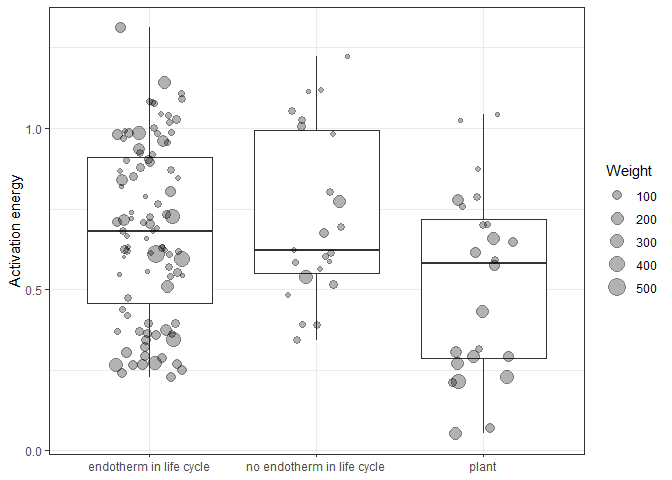<!-- -->

When we plot these groups as a function of mean annual temperature, we
then see that, at a given temperature, species exclusively infecting
ectotherms have higher AE. This pattern is not strong, but it is
consistent with the idea that environmental stability lowers AE
(endotherms provide a stable temperature for helminths).

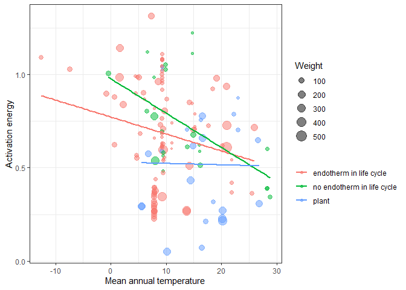<!-- -->

#### Stage in or out of host?

Stages inside a host may be more shielded from temperature variation
than stages in the environment. Let’s add this distinction to the model.

This term is not significant and the model DIC is worse.

    ## 
    ##  Iterations = 3001:62951
    ##  Thinning interval  = 50
    ##  Sample size  = 1200 
    ## 
    ##  DIC: -52.0404 
    ## 
    ##  G-structure:  ~binomial
    ## 
    ##          post.mean l-95% CI u-95% CI eff.samp
    ## binomial   0.01703 0.003858  0.03284    958.3
    ## 
    ##                ~tree_tips
    ## 
    ##           post.mean l-95% CI u-95% CI eff.samp
    ## tree_tips   0.04762 0.004376   0.1167    679.9
    ## 
    ##                ~idh(stderr_arr):units
    ## 
    ##                  post.mean l-95% CI u-95% CI eff.samp
    ## stderr_arr.units         1        1        1        0
    ## 
    ##  R-structure:  ~units
    ## 
    ##       post.mean l-95% CI u-95% CI eff.samp
    ## units   0.02663  0.01732  0.03643     1096
    ## 
    ##  Location effects: E_Arr ~ mean_ann_temp_cen + dist_zone + habitat_d1 + endo_ecto2 + devo_type 
    ## 
    ##                                      post.mean  l-95% CI  u-95% CI
    ## (Intercept)                           0.604314  0.320844  0.874790
    ## mean_ann_temp_cen                    -0.015948 -0.024467 -0.007212
    ## dist_zonetemperate                   -0.055524 -0.235794  0.118604
    ## dist_zonesubtropical                  0.180679 -0.046700  0.422269
    ## dist_zonetropical                     0.171388 -0.141615  0.417286
    ## dist_zoneglobal                       0.058342 -0.106578  0.244256
    ## habitat_d1terrestrial                 0.120755 -0.077639  0.332393
    ## endo_ecto2no endotherm in life cycle  0.120425 -0.028132  0.257241
    ## endo_ecto2plant                      -0.170275 -0.478728  0.085044
    ## devo_typeoutside host                 0.032914 -0.083872  0.134939
    ##                                      eff.samp   pMCMC    
    ## (Intercept)                            1200.0 < 8e-04 ***
    ## mean_ann_temp_cen                      1200.0 0.00167 ** 
    ## dist_zonetemperate                     1200.0 0.55667    
    ## dist_zonesubtropical                   1200.0 0.14333    
    ## dist_zonetropical                      1200.0 0.20833    
    ## dist_zoneglobal                        1200.0 0.53000    
    ## habitat_d1terrestrial                   960.2 0.24167    
    ## endo_ecto2no endotherm in life cycle   1200.0 0.09000 .  
    ## endo_ecto2plant                        1200.0 0.19667    
    ## devo_typeoutside host                  1200.0 0.53333    
    ## ---
    ## Signif. codes:  0 '***' 0.001 '**' 0.01 '*' 0.05 '.' 0.1 ' ' 1

Though the difference is not significant, worms outside the host have
slightly higher AEs, which is also consistent with the idea that
environmental variation favors higher AE. The plot also shows that
habitat and in/outside host are conflated, as proportionally more of the
terrestrial values are outside the host and more of the aquatic values
are inside the host.

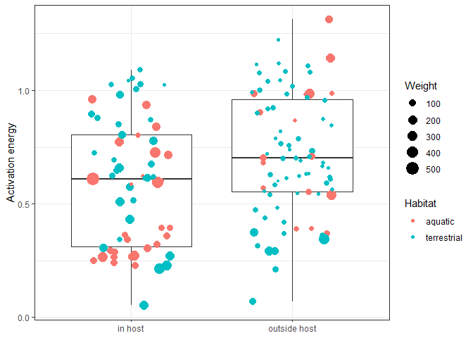<!-- -->

#### Target host

Stages free in the environment are generally propagules that target the
next host in the life cycle. Are the parasites targeting a vertebrate or
an invertebrate? It is not obvious to me that this should matter. But
nonetheless, we can check it.

Distinguishing between invertebrates and vertebrates as next host does
not improve the model.

    ## 
    ##  Iterations = 3001:62951
    ##  Thinning interval  = 50
    ##  Sample size  = 1200 
    ## 
    ##  DIC: -53.85288 
    ## 
    ##  G-structure:  ~binomial
    ## 
    ##          post.mean l-95% CI u-95% CI eff.samp
    ## binomial   0.01472 0.003575  0.02879    781.1
    ## 
    ##                ~tree_tips
    ## 
    ##           post.mean l-95% CI u-95% CI eff.samp
    ## tree_tips   0.04864 0.004654   0.1204    696.6
    ## 
    ##                ~idh(stderr_arr):units
    ## 
    ##                  post.mean l-95% CI u-95% CI eff.samp
    ## stderr_arr.units         1        1        1        0
    ## 
    ##  R-structure:  ~units
    ## 
    ##       post.mean l-95% CI u-95% CI eff.samp
    ## units   0.02647   0.0168  0.03652     1200
    ## 
    ##  Location effects: E_Arr ~ mean_ann_temp_cen + dist_zone + habitat_d1 + endo_ecto2 + devo_type3 
    ## 
    ##                                            post.mean  l-95% CI  u-95% CI
    ## (Intercept)                                 0.578885  0.309378  0.899163
    ## mean_ann_temp_cen                          -0.013274 -0.022365 -0.004355
    ## dist_zonetemperate                         -0.028658 -0.213817  0.145428
    ## dist_zonesubtropical                        0.122138 -0.120767  0.354022
    ## dist_zonetropical                           0.156255 -0.101497  0.443630
    ## dist_zoneglobal                             0.077264 -0.095268  0.253733
    ## habitat_d1terrestrial                       0.199562  0.002855  0.416542
    ## endo_ecto2no endotherm in life cycle        0.029043 -0.116238  0.174261
    ## endo_ecto2plant                            -0.190010 -0.481545  0.110685
    ## devo_type3in plant                         -0.102088 -0.290680  0.090316
    ## devo_type3outside host: targets invert      0.110816 -0.049271  0.270621
    ## devo_type3outside host: targets vertebrate -0.176497 -0.380512  0.014844
    ##                                            eff.samp  pMCMC    
    ## (Intercept)                                    1351 <8e-04 ***
    ## mean_ann_temp_cen                              1200 <8e-04 ***
    ## dist_zonetemperate                             1200 0.7583    
    ## dist_zonesubtropical                           1200 0.3267    
    ## dist_zonetropical                              1200 0.2800    
    ## dist_zoneglobal                                1200 0.4050    
    ## habitat_d1terrestrial                          1200 0.0600 .  
    ## endo_ecto2no endotherm in life cycle           1200 0.7383    
    ## endo_ecto2plant                                1536 0.2000    
    ## devo_type3in plant                             1200 0.3167    
    ## devo_type3outside host: targets invert         1200 0.1783    
    ## devo_type3outside host: targets vertebrate     1200 0.0667 .  
    ## ---
    ## Signif. codes:  0 '***' 0.001 '**' 0.01 '*' 0.05 '.' 0.1 ' ' 1

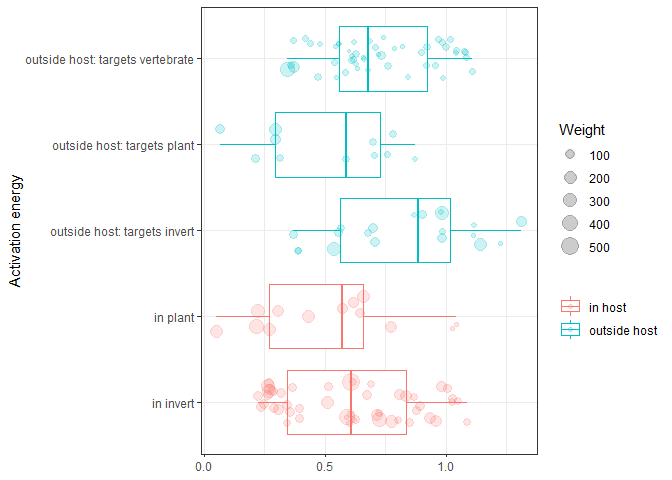<!-- -->

# Conclusions

In this analysis of activation energies in helminths, I account for
measurement variance (standard error of activation energy estimates) and
I account for two sources of pseudoreplication: (1) multiple
measurements on a single parasite species and (2) shared ancestry. A
mixed model including both factors suggested that shared ancestry has a
clear effect on AEs: related species tend to exhibit similar activation
energies.

Next, I evaluated various environmental characteristics and found that
activation energies tend to be higher at low temperatures and high
latitudes. Finally, I assessed characteristics of the host-parasite
interaction, and I found that animal parasites with endotherms in the
life cycle tend to have lower AE, consistent with the notion of
temperature stability affecting temperature sensitivities.

Finally, let’s quantitatively summarize the results. For each of the
fitted models, I compiled the df, the DIC, and the R2. I
calculated R2 according to [Nakagawa and
Schielzeth 2013](https://besjournals.onlinelibrary.wiley.com/doi/full/10.1111/j.2041-210x.2012.00261.x%4010.1111/%28ISSN%292041-210X.STATSTOO).
They distinguish between marginal and conditional R2.
Marginal R2 is the proportion of variation explained by the
fixed effects while conditional R2 is the variation explained
by both fixed and random effects. When the term is followed by an
asterisk, I retained it in the model.

| model                                 | df | df\_used |     DIC |  R2m |  R2c |
| :------------------------------------ | -: | -------: | ------: | ---: | ---: |
| just within-species\*                 |  3 |       NA | \-27.72 | 0.00 | 0.54 |
| \+ phylogeny\*                        |  4 |        1 | \-44.64 | 0.00 | 0.77 |
| \+ mean annual temp\*                 |  5 |        1 | \-47.27 | 0.02 | 0.76 |
| \+ min/max temps                      |  7 |        2 | \-52.08 | 0.04 | 0.75 |
| \+ latitude                           |  6 |      \-1 | \-47.54 | 0.04 | 0.69 |
| \+ distribution zone\*                |  9 |        3 | \-48.08 | 0.09 | 0.71 |
| \+ habitat (aquatic vs terrestrial)\* | 10 |        1 | \-49.42 | 0.11 | 0.78 |
| \+ distribution x habitat interacton  | 13 |        3 | \-47.81 | 0.14 | 0.79 |
| \+ plant vs animal parasite\*         | 11 |      \-2 | \-49.97 | 0.21 | 0.81 |
| \+ endotherm in life cycle?\*         | 12 |        1 | \-53.10 | 0.22 | 0.75 |
| \+ stage in/out of host\*             | 13 |        1 | \-52.04 | 0.19 | 0.77 |
| \+ target host: invert vs vert        | 15 |        2 | \-53.85 | 0.21 | 0.76 |

The most complex model, one that includes phylogeny, seemingly important
environmental variables, and characteristics of the host-parasite
system, explained over 77% of the variation in activation energy. Much
of this is due to the random effects (phylogeny and repeated measures
account for \>50% of the variation), but around 20% of the variation can
be explained by fixed effects.
