Determinants of helminth activation energy (Sharpe-Schoolfield)
================
Dan Benesh
November 4, 2019

The purpose of this notebook is to explore and model the activation
energies for helminth development. I specifically use activation
energies fit with the **Sharpe-Schoolfield** model.

# Get data organized

First, I get the data organized for modelling. From the table of curve
fits, I take the **Sharpe-Schoolfield** activation energies and add them
to the table including the predictors.

How many AE estimates are there?

    ## [1] 142

How many unique species are in the data?

    ## [1] 88

So there are a fair number of species with multiple curves.

### Look at the response - activation energy

What is the distribution of activation energies?

<!-- -->

The median activation energy was 1.04.

How confident are we in each activation energy estimate? For this, we
look at the distribution of standard error estimates for the activation
energies. Most are small, but there is an outlier.

<!-- -->

All else equal, we should have more confidence in curves fit with a
larger number of temperatures. To reflect this, standard error should
decrease with sample size (i.e. number of temperatures). But this is not
obvious when we plot standard error as a function of temperatures.

<!-- -->

When we zoom in to exclude the outlier, there is still not a clear
relationship between standard error and the number of temperatures.
However, the largest standard errors are observed with the lowest sample
sizes (left-hand part of plot), which is reassuring.

<!-- -->

With less precision (higher standard errors), we would expect a broader
distribution of activation energy estimates. Let’s look at the
distribution of activation energies split by whether standard error was
high or low (above or below the median SE). Surprisingly, the estimates
with high standard errors do not have a wider distribution, opposite to
expectations.

<!-- -->

The median of the distribution also seems to vary with standard error;
high standard error is associated with higher activation energy.

    ## # A tibble: 2 x 2
    ##   se_cat              median_AE
    ##   <chr>                   <dbl>
    ## 1 high standard error     1.21 
    ## 2 low standard error      0.786

Thus, when we weight the data points by the standard error of the
activation energies, it should shift the overall mean down.

How many AE estimates per species?

    ##    binomial               n        
    ##  Length:87          Min.   :1.000  
    ##  Class :character   1st Qu.:1.000  
    ##  Mode  :character   Median :1.000  
    ##                     Mean   :1.632  
    ##                     3rd Qu.:2.000  
    ##                     Max.   :8.000

Usually just one, but up to 8. For visualizing, I’ll randomly take one
AE per species.

This reduces the data from n = 142 to n = 87.

Make a plot of the distribution of activation energy across the tree.

<!-- -->

The bars on the right are the estimated activation energies. Maybe some
clades at the top (nematodes) have higher values than those at the
bottom (flatworms), but it is not conspicuous. I don’t think that is
super surprising, because I assume AE is a parameter that is subject to
a fair amount of measurement error.

# Phylogenetic mixed models

I’ll fit phylogenetic mixed models (see
[here](https://onlinelibrary.wiley.com/doi/full/10.1111/j.1420-9101.2009.01915.x)
for an overview of these models) using the `MCMCglmm` library. These are
not simple models, but the Bayesian `MCMCglmm` package does allow us to
fit both within- and between-species effects in the same model. It also
allows us to weight the activation energies by their standard errors.

Before diving into the models, though, let’s outline a model-building
strategy. First, I fit a ‘base’ model with the tangential variables.
Here, I would include phylogeny and within-species variation. From the
outset, I weight each data point by the standard error of activation
energy. This weight was incorporated into the model as suggested
[here](https://ourcodingclub.github.io/2018/01/22/mcmcglmm.html) and in
the `MCMCglmm` course notes. Second, I add biologically interesting
variables to this base model. Here, I would categorize interesting
variables into two groups: (1) characteristics of the external
environment (like latitude, aquatic vs terrestrial, etc.) and (2)
characteristics of the parasite (e.g. in or out of host, stage in the
life cycle, etc.). With this as a plan, let’s get modelling.

### Within-species effect

First, I create a null model that includes a parasite species random
effect, but not a phylogenetic effect. Throughout, data points are
weighted by their standard error.

After fitting an MCMC model, a first quality check is looking at chain
mixing. Essentially, we want the chain to bounce back and forth randomly
- it shouldn’t get stuck at particular parameter estimates.

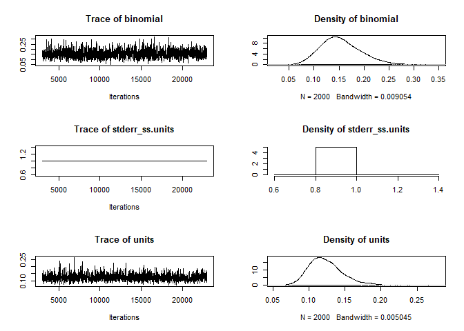<!-- -->

The within-species effect, `binomial`, mixes well and is non-zero,
suggesting that multiple AE measurements on the same species tend to be
similar. The variance component for `std-error` is fixed at 1, such that
the weights assigned do not change as the posterior distribution is
sampled by the Markov chain.

The model intercept (the average activation energy) is about 1.05.

    ## 
    ##  Iterations = 3001:22991
    ##  Thinning interval  = 10
    ##  Sample size  = 2000 
    ## 
    ##  DIC: 160.6466 
    ## 
    ##  G-structure:  ~binomial
    ## 
    ##          post.mean l-95% CI u-95% CI eff.samp
    ## binomial    0.1539  0.08242   0.2359     1741
    ## 
    ##                ~idh(stderr_ss):units
    ## 
    ##                 post.mean l-95% CI u-95% CI eff.samp
    ## stderr_ss.units         1        1        1        0
    ## 
    ##  R-structure:  ~units
    ## 
    ##       post.mean l-95% CI u-95% CI eff.samp
    ## units    0.1236  0.08058   0.1722     2000
    ## 
    ##  Location effects: E_SS ~ 1 
    ## 
    ##             post.mean l-95% CI u-95% CI eff.samp  pMCMC    
    ## (Intercept)     1.056    0.943    1.157     2000 <5e-04 ***
    ## ---
    ## Signif. codes:  0 '***' 0.001 '**' 0.01 '*' 0.05 '.' 0.1 ' ' 1

Here’s the proportion of variation attributable to the within-species
effect.

    ## [1] 0.557796

It is high. On the one hand this makes sense, as many species only had a
single measurement (and hence no residual value after accounting for a
‘species effect’). Here’s an attempt to visualize the variation in
activation energy estimates for the species that had multiple
measurements. The species are ordered by their median activation energy.
One can see that some species tend to have very similar measurements,
while for other species, there is a fair amount of spread in the
estimated activation energies.

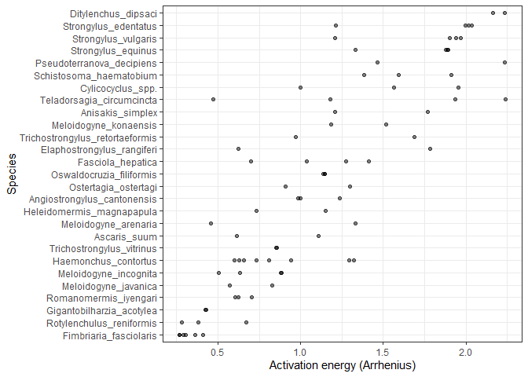<!-- -->

### Phylogenetic effect

Now, let’s add phylogenetic effects to this mixed model. To do this, we
create the phylogenetic covariance matrix and then include this as a
random effect.

For this model, the chain needs to be run for longer to get reasonable
mixing, partly because the two random effects are related. If the model
estimates higher values for the within-species variance component, it
estimates less for the phylogenetic component, and vice versa.

After fitting, we can again plot the chains. They look good. The
within-species effect (`binomial`) is smaller than the phylogenetic
effect (`tree_tips`) and it pushes up against zero.

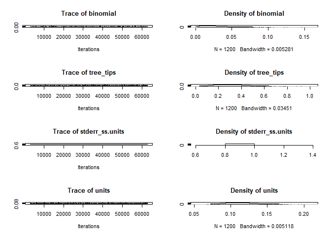<!-- -->

These results suggest that phylogenetically related species tend to have
similar AEs, and when a species is measured multiple times, the
estimated AEs are similar, though they are not far more similar than
what they are expected to be based on phylogeny (i.e. the within-species
effect does not explain much additional variation beyond phylogeny).

The phylogenetic effect is strong. It explained 68% of the variation in
AE.

By contrast, the ‘species’ effect explained 5% of the variation.

Here’s a plot splitting AE by parasite order. It does look like some
clades tend to have higher or lower AEs.

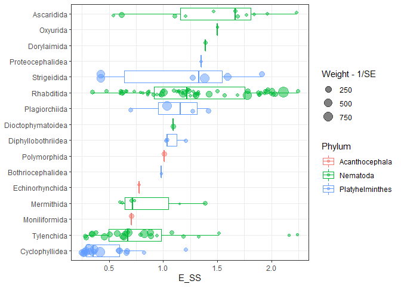<!-- -->

### Environmental variables

Now, we move onto environmental variables of interest, though it is
important to keep phylogenetic effects in mind during this modeling
exercies. Essentially, any explanatory variable that is phylogenetically
structured will “compete” with the phylogenetic random effect to explain
variation in AE.

I have tried to find a series of logical steps to testing environmental
correlates of helminth AE. First and foremost, we expect AE to be
related to environmental temperature, so I start with temperature
variables.

#### Mean temperature

There are three temperature measurements in the data: mean, max, and min
for the location. I would expect the three temp variables to be tightly
correlated, so let’s start by just adding the mean to the model. Note
that I have centered the continuous variables around their median, such
that the model parameters are estimated at e.g. the data’s median annual
temperature.

The effect of mean locale temperature is negative but not significant.

    ## 
    ##  Iterations = 3001:62951
    ##  Thinning interval  = 50
    ##  Sample size  = 1200 
    ## 
    ##  DIC: 141.5425 
    ## 
    ##  G-structure:  ~binomial
    ## 
    ##          post.mean l-95% CI u-95% CI eff.samp
    ## binomial   0.03059 0.002912  0.07457    834.6
    ## 
    ##                ~tree_tips
    ## 
    ##           post.mean l-95% CI u-95% CI eff.samp
    ## tree_tips    0.2776  0.05882   0.5113     1002
    ## 
    ##                ~idh(stderr_ss):units
    ## 
    ##                 post.mean l-95% CI u-95% CI eff.samp
    ## stderr_ss.units         1        1        1        0
    ## 
    ##  R-structure:  ~units
    ## 
    ##       post.mean l-95% CI u-95% CI eff.samp
    ## units    0.1143   0.0796   0.1541     1200
    ## 
    ##  Location effects: E_SS ~ mean_ann_temp_cen 
    ## 
    ##                   post.mean  l-95% CI  u-95% CI eff.samp   pMCMC   
    ## (Intercept)        1.029373  0.560553  1.561525     1200 0.00333 **
    ## mean_ann_temp_cen -0.009015 -0.021941  0.004191     1200 0.16000   
    ## ---
    ## Signif. codes:  0 '***' 0.001 '**' 0.01 '*' 0.05 '.' 0.1 ' ' 1

For species living at lower temperatures, development speeds up more as
temperature increases. It also does not look like this depends on
whether an exact study location was given.

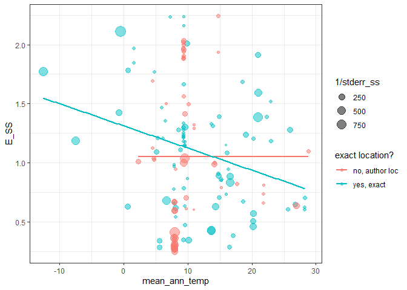<!-- -->

#### Temperature variation

A mean temperature does not indicate the temperature range a parasite is
exposed to. Thus, as the next modelling step, we’ll include location min
and max temps. None of these terms are significant and the model DIC
decreases, suggesting adding temperature extremes does not improve the
model.

    ## 
    ##  Iterations = 3001:62951
    ##  Thinning interval  = 50
    ##  Sample size  = 1200 
    ## 
    ##  DIC: 142.8285 
    ## 
    ##  G-structure:  ~binomial
    ## 
    ##          post.mean l-95% CI u-95% CI eff.samp
    ## binomial   0.03386 0.001922  0.08491    796.1
    ## 
    ##                ~tree_tips
    ## 
    ##           post.mean l-95% CI u-95% CI eff.samp
    ## tree_tips    0.2909  0.06606   0.5559      850
    ## 
    ##                ~idh(stderr_ss):units
    ## 
    ##                 post.mean l-95% CI u-95% CI eff.samp
    ## stderr_ss.units         1        1        1        0
    ## 
    ##  R-structure:  ~units
    ## 
    ##       post.mean l-95% CI u-95% CI eff.samp
    ## units    0.1154  0.07796   0.1549     1200
    ## 
    ##  Location effects: E_SS ~ mean_ann_temp_cen + max_month_temp_cen + min_month_temp_cen 
    ## 
    ##                    post.mean  l-95% CI  u-95% CI eff.samp  pMCMC    
    ## (Intercept)         1.022771  0.460707  1.601809     1200 <8e-04 ***
    ## mean_ann_temp_cen  -0.014595 -0.136156  0.100616     1200  0.798    
    ## max_month_temp_cen  0.007215 -0.060335  0.078991     1200  0.815    
    ## min_month_temp_cen  0.001037 -0.054764  0.060124     1200  0.970    
    ## ---
    ## Signif. codes:  0 '***' 0.001 '**' 0.01 '*' 0.05 '.' 0.1 ' ' 1

Interestingly, the parameter estimates for max and min temps are
positive, which is opposite to the trend seen with mean temp. But when
we plot AE as a function of max and min, we see a negative relationship
just like for mean temp: low temps, high AE.

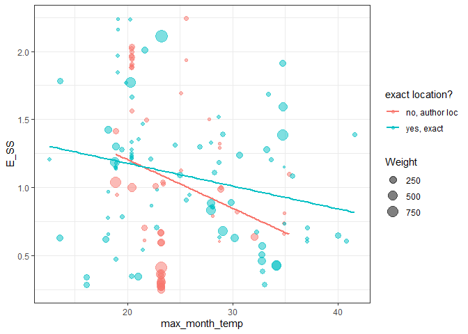<!-- -->

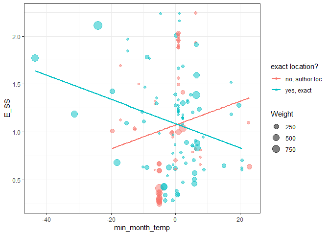<!-- -->

This is suggestive that, once controlling for mean temp, activation
energies increase with higher max and min temps. However, as neither min
nor max seems to explain additional variation in activation energy, we
won’t consider these temperature extremes further.

#### Seasonality

Variation in temperature is one component of seasonality, but not the
only one. Season length, photoperiod, rainfall, etc. may all vary with
seasons and perhaps impact the thermal-dependence of parasite
development. The dataset contains two variables that might capture
seasonality: latitude and distribution. Distribution zones were defined
as ‘tropics’, ‘temperate’, ‘polar’, etc., which means this variable
overlaps substantially with latitude. Consequently, I examine these two
variables in parallel (i.e. I won’t put both in the same model).

##### Latitude

Let’s look at latitude first, as it is a single continuous variable
while distribution is multiple categories. In some cases, a study gave a
detailed location, so our data contains exact latitudes. In other cases,
no site was given and the author’s location was taken as a rough proxy
of the study’s location. Most records were from the Northern hemisphere,
but a few were from the Southern hemisphere. Thus, I took the absolute
value of latitude, essentially the distance from the equator.

There is not a clear relationship between AE and latitude.

    ## 
    ##  Iterations = 3001:62951
    ##  Thinning interval  = 50
    ##  Sample size  = 1200 
    ## 
    ##  DIC: 142.3367 
    ## 
    ##  G-structure:  ~binomial
    ## 
    ##          post.mean l-95% CI u-95% CI eff.samp
    ## binomial   0.03346 0.002126  0.07865    720.7
    ## 
    ##                ~tree_tips
    ## 
    ##           post.mean l-95% CI u-95% CI eff.samp
    ## tree_tips     0.263  0.05323    0.506    795.4
    ## 
    ##                ~idh(stderr_ss):units
    ## 
    ##                 post.mean l-95% CI u-95% CI eff.samp
    ## stderr_ss.units         1        1        1        0
    ## 
    ##  R-structure:  ~units
    ## 
    ##       post.mean l-95% CI u-95% CI eff.samp
    ## units    0.1152  0.07964   0.1553     1170
    ## 
    ##  Location effects: E_SS ~ mean_ann_temp_cen + lat_abs 
    ## 
    ##                   post.mean  l-95% CI  u-95% CI eff.samp  pMCMC    
    ## (Intercept)        1.375465  0.635239  2.105945     1060 <8e-04 ***
    ## mean_ann_temp_cen -0.021391 -0.043559  0.000876     1136 0.0633 .  
    ## lat_abs           -0.007266 -0.019006  0.004654     1055 0.2183    
    ## ---
    ## Signif. codes:  0 '***' 0.001 '**' 0.01 '*' 0.05 '.' 0.1 ' ' 1

Surprisingly, the parameter estimate for latitude is negative, but when
we plot it, we see that activation energies tend to increase with
latitude.

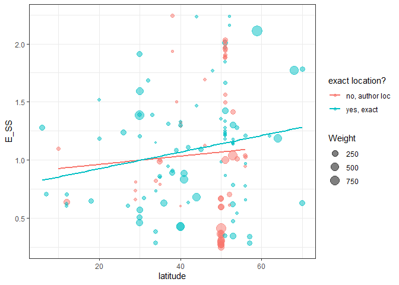<!-- -->

This suggests that, like for `min` and `max` temperature, correlations
among variables (here between mean temp and latitude) might cause
counterintuitive or spurious results. When we remove the effect of mean
temperature on activation energy (i.e. we take the residuals of the
model with just mean temp), and then plot the residual variation as a
function of latitude, we see essentially no relationship between
latitude and activation energy.

<!-- -->

Let’s look at the next variable, which is related to latitude.

##### Climate zones

Our latitude variable is not a perfect representation of a parasite’s
‘ancestral’ habitat. Many species in the data are associated with
people or livestock and have thus been moved all around the world. This
is reflected in the distribution zone variable: it contains a category
for parasites with a broad distribution.

However, the distribution categories are still tightly linked to
latitude.

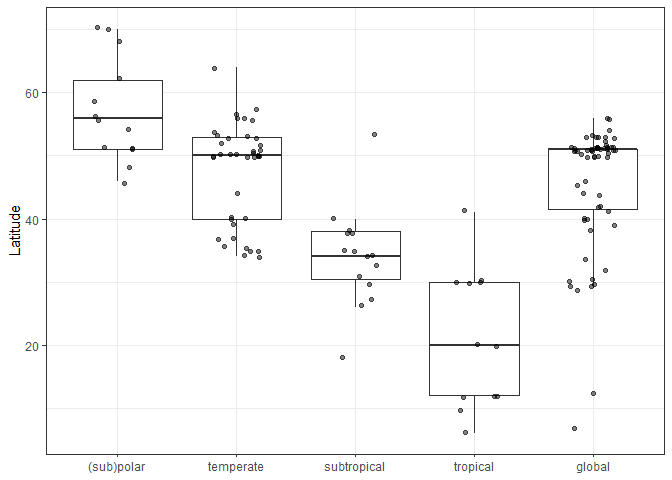<!-- -->

Nonetheless, let’s add this variable to the model instead of latitude.

Several contrasts among these categories are marginally significant and
the model DIC decreases.

    ## 
    ##  Iterations = 3001:62951
    ##  Thinning interval  = 50
    ##  Sample size  = 1200 
    ## 
    ##  DIC: 133.91 
    ## 
    ##  G-structure:  ~binomial
    ## 
    ##          post.mean l-95% CI u-95% CI eff.samp
    ## binomial   0.03838 0.003457  0.09225    734.6
    ## 
    ##                ~tree_tips
    ## 
    ##           post.mean l-95% CI u-95% CI eff.samp
    ## tree_tips    0.2598  0.04234   0.5106    919.7
    ## 
    ##                ~idh(stderr_ss):units
    ## 
    ##                 post.mean l-95% CI u-95% CI eff.samp
    ## stderr_ss.units         1        1        1        0
    ## 
    ##  R-structure:  ~units
    ## 
    ##       post.mean l-95% CI u-95% CI eff.samp
    ## units     0.105  0.06664   0.1401     1200
    ## 
    ##  Location effects: E_SS ~ mean_ann_temp_cen + dist_zone 
    ## 
    ##                      post.mean  l-95% CI  u-95% CI eff.samp   pMCMC   
    ## (Intercept)           0.946746  0.397029  1.529815   1200.0 0.00667 **
    ## mean_ann_temp_cen    -0.023268 -0.042044 -0.007544   1200.0 0.00500 **
    ## dist_zonetemperate   -0.059306 -0.388247  0.261223    937.3 0.74167   
    ## dist_zonesubtropical  0.397670 -0.012823  0.848896   1200.0 0.07333 . 
    ## dist_zonetropical     0.508095 -0.005654  1.071977   1202.7 0.06167 . 
    ## dist_zoneglobal       0.140411 -0.226753  0.441408   1200.0 0.43500   
    ## ---
    ## Signif. codes:  0 '***' 0.001 '**' 0.01 '*' 0.05 '.' 0.1 ' ' 1

Consistent with the pattern for temperature and latitude, polar species
tend to have higher AE. But weirdly, a non-linear relationship with
latitude seems to emerge, with AE peaking in polar habitats, decreasing
in temperate habitats, and then increasing again toward the equator.

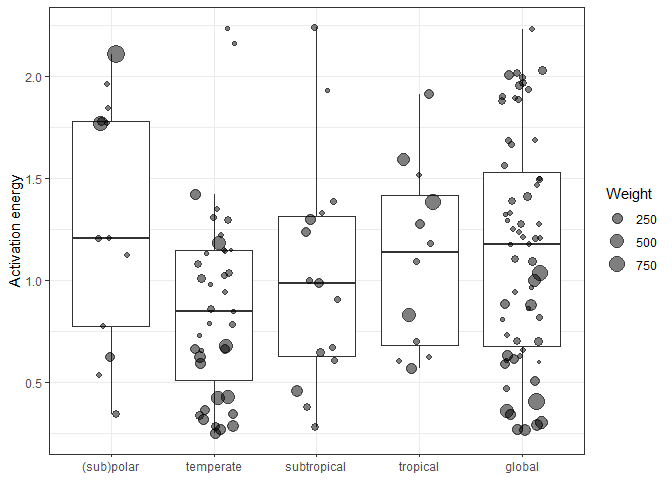<!-- -->

Latitude and distribution overlap and presumably explain the same
variation in AE, but which explains it better? We can compare the models
with latitude vs distribution zone using information criteria. Here is
the progression of model fits thus far (low DIC, better model):

    ## [1] "DIC for model with phylogeny: 140.3"

    ## [1] "DIC for model with just mean temp: 141.5"

    ## [1] "DIC for model with latitude: 142.3"

    ## [1] "DIC for model with distribution zone: 133.9"

According to this measure, the model with distribution is better than
the one with latitude, which is not surprising given the seemingly
non-linear relationship with latitude. Another explanation for this, is
that including distribution zone strengthens the estimated effect of
mean annual temperature; it explains residual variation around the
temp-AE relationship.

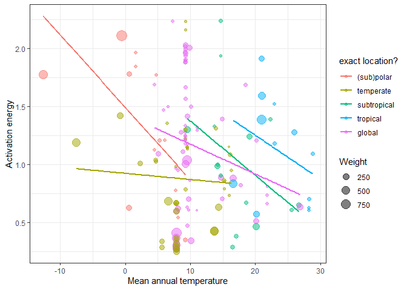<!-- -->

Thus, I’ll retain distribution in the model as a proxy for seasonality,
but I’ll drop latitude.

#### Habitat - aquatic vs freshwater

As a final environmental variable, we can add parasite habitat: aquatic
vs terrestrial. Water dampens temperature swings, such that seasonality
is less pronounced in aquatic habitats compared to terrestrial ones.
Thus, this variable might modify the effect of seasonality proxies like
distribution zone. (Note: for a couple TPCs, I filled in habitat and
distribution data.)

Adding habitat to the model improves DIC, but the parameter is not
significant.

    ## 
    ##  Iterations = 3001:62951
    ##  Thinning interval  = 50
    ##  Sample size  = 1200 
    ## 
    ##  DIC: 129.1307 
    ## 
    ##  G-structure:  ~binomial
    ## 
    ##          post.mean l-95% CI u-95% CI eff.samp
    ## binomial   0.02791 0.001933  0.07204    788.8
    ## 
    ##                ~tree_tips
    ## 
    ##           post.mean l-95% CI u-95% CI eff.samp
    ## tree_tips    0.3387   0.0798   0.6391    866.8
    ## 
    ##                ~idh(stderr_ss):units
    ## 
    ##                 post.mean l-95% CI u-95% CI eff.samp
    ## stderr_ss.units         1        1        1        0
    ## 
    ##  R-structure:  ~units
    ## 
    ##       post.mean l-95% CI u-95% CI eff.samp
    ## units     0.101  0.06951   0.1356     1200
    ## 
    ##  Location effects: E_SS ~ mean_ann_temp_cen + dist_zone + habitat_d1 
    ## 
    ##                       post.mean l-95% CI u-95% CI eff.samp   pMCMC   
    ## (Intercept)             0.84814  0.18165  1.48006     1245 0.01500 * 
    ## mean_ann_temp_cen      -0.02543 -0.04280 -0.01138     1200 0.00167 **
    ## dist_zonetemperate     -0.05590 -0.38806  0.26912     1200 0.74833   
    ## dist_zonesubtropical    0.40019 -0.01343  0.87748     1200 0.06833 . 
    ## dist_zonetropical       0.54521  0.04859  1.08633     1200 0.04000 * 
    ## dist_zoneglobal         0.10769 -0.23353  0.41764     1200 0.51333   
    ## habitat_d1terrestrial   0.32489 -0.03854  0.72775     1574 0.08667 . 
    ## ---
    ## Signif. codes:  0 '***' 0.001 '**' 0.01 '*' 0.05 '.' 0.1 ' ' 1

Terrestrial species have higher AE on average than aquatic species
(combines both freshwater and marine species).

<!-- -->

We might expect the aquatic - terrestrial dichotomy to be particularly
important in more seasonal locations. That is, there may be an
interaction between our seasonality proxy (distribution) and habitat.
Unfortunately, this cuts the data quite thin, as there are not many
freshwater and terrestrial species in each distribution category.

<!-- -->

When we add this interaction to the model, it is not an improvement.

    ## 
    ##  Iterations = 3001:62951
    ##  Thinning interval  = 50
    ##  Sample size  = 1200 
    ## 
    ##  DIC: 131.7762 
    ## 
    ##  G-structure:  ~binomial
    ## 
    ##          post.mean l-95% CI u-95% CI eff.samp
    ## binomial   0.02798 0.002115  0.07162    821.8
    ## 
    ##                ~tree_tips
    ## 
    ##           post.mean l-95% CI u-95% CI eff.samp
    ## tree_tips      0.34  0.07549   0.6561    880.9
    ## 
    ##                ~idh(stderr_ss):units
    ## 
    ##                 post.mean l-95% CI u-95% CI eff.samp
    ## stderr_ss.units         1        1        1        0
    ## 
    ##  R-structure:  ~units
    ## 
    ##       post.mean l-95% CI u-95% CI eff.samp
    ## units    0.1028  0.06786   0.1406     1200
    ## 
    ##  Location effects: E_SS ~ mean_ann_temp + dist_zone * habitat_d1 
    ## 
    ##                                          post.mean  l-95% CI  u-95% CI
    ## (Intercept)                               1.192864  0.577079  1.898143
    ## mean_ann_temp                            -0.027449 -0.044556 -0.011785
    ## dist_zonetemperate                       -0.196685 -0.683804  0.308324
    ## dist_zonesubtropical                      0.510111  0.008614  1.016593
    ## dist_zonetropical                         0.619121 -0.112892  1.425949
    ## dist_zoneglobal                          -0.095884 -0.560286  0.492165
    ## habitat_d1terrestrial                     0.123252 -0.629909  0.765244
    ## dist_zonetemperate:habitat_d1terrestrial  0.241449 -0.474574  0.908785
    ## dist_zonetropical:habitat_d1terrestrial  -0.066966 -1.050830  0.826178
    ## dist_zoneglobal:habitat_d1terrestrial     0.321173 -0.362923  0.991948
    ##                                          eff.samp   pMCMC    
    ## (Intercept)                                  1200 < 8e-04 ***
    ## mean_ann_temp                                1089 0.00167 ** 
    ## dist_zonetemperate                           1200 0.42000    
    ## dist_zonesubtropical                         1113 0.04667 *  
    ## dist_zonetropical                            1200 0.10667    
    ## dist_zoneglobal                              1200 0.72667    
    ## habitat_d1terrestrial                        1200 0.70167    
    ## dist_zonetemperate:habitat_d1terrestrial     1200 0.49167    
    ## dist_zonetropical:habitat_d1terrestrial      1200 0.88333    
    ## dist_zoneglobal:habitat_d1terrestrial        1200 0.33667    
    ## ---
    ## Signif. codes:  0 '***' 0.001 '**' 0.01 '*' 0.05 '.' 0.1 ' ' 1

To summarize, AE tends to be higher with low mean locale temperatures
and terrestrial habitats.

### Host-parasite characteristics

Now, we turn from the environment to variables describing the
host-parasite interaction. I consider a few variables: (1) host type,
(2) stage in or out of host, and (3) target host. Compared to the
environmental variables, these variables are not as obviously
confounded.

#### Plant vs animal parasite

A major dichotomy is between between plant and animal parasites. This
might be relevant if plant and animal hosts have different activation
energies or if they differ in how much they ‘protect’ parasites from
temperature variation.

Distinguishing plants and animals is not significant, though the model
DIC goes down. Plant parasites tend to have lower AE than animal
parasites. Also, I imagine this distinction is strongly conflated with
phylogeny.

    ## 
    ##  Iterations = 3001:62951
    ##  Thinning interval  = 50
    ##  Sample size  = 1200 
    ## 
    ##  DIC: 128.9964 
    ## 
    ##  G-structure:  ~binomial
    ## 
    ##          post.mean l-95% CI u-95% CI eff.samp
    ## binomial   0.02974 0.001701  0.07444    725.2
    ## 
    ##                ~tree_tips
    ## 
    ##           post.mean l-95% CI u-95% CI eff.samp
    ## tree_tips    0.3333  0.05033   0.6323    731.4
    ## 
    ##                ~idh(stderr_ss):units
    ## 
    ##                 post.mean l-95% CI u-95% CI eff.samp
    ## stderr_ss.units         1        1        1        0
    ## 
    ##  R-structure:  ~units
    ## 
    ##       post.mean l-95% CI u-95% CI eff.samp
    ## units     0.101  0.06763   0.1379     1317
    ## 
    ##  Location effects: E_SS ~ mean_ann_temp_cen + dist_zone + habitat_d1 + plant_anim 
    ## 
    ##                       post.mean l-95% CI u-95% CI eff.samp  pMCMC    
    ## (Intercept)             0.83139  0.18822  1.41499     1200 0.0133 *  
    ## mean_ann_temp_cen      -0.02554 -0.04277 -0.01039     1200 <8e-04 ***
    ## dist_zonetemperate     -0.04413 -0.38341  0.27121     1200 0.7850    
    ## dist_zonesubtropical    0.42975 -0.05170  0.84560     1200 0.0750 .  
    ## dist_zonetropical       0.55358  0.04017  1.08114     1200 0.0350 *  
    ## dist_zoneglobal         0.11168 -0.27049  0.42609     1200 0.5167    
    ## habitat_d1terrestrial   0.37359 -0.02697  0.75203     1200 0.0617 .  
    ## plant_animplant        -0.26509 -0.86766  0.36648     1200 0.3933    
    ## ---
    ## Signif. codes:  0 '***' 0.001 '**' 0.01 '*' 0.05 '.' 0.1 ' ' 1

Here’s the plot comparing plant and animal parasites.

<!-- -->

#### Endotherm in life cycle

Besides the plant - animal distinction, parasites can be distinguished
by whether or not they have an endotherm (a bird or mammal) in the life
cycle. Since endotherm body temperatures are commonly higher than
ambient temperatures, we might expect AE to differ between species with
or without such a host in the life cycle.

This variable basically retains the previous plant-animal dichotomy, but
it additionally splits animal parasites into two groups.

    ##                             
    ##                              animal plant
    ##   endotherm in life cycle        95     0
    ##   no endotherm in life cycle     23    24

We can thus combine these into a single variable to add to the model.

The term contrasting animal parasites with and without endotherms in the
cycle was significant, and it suggested that species without endotherms
have higher AEs.

    ## 
    ##  Iterations = 3001:62951
    ##  Thinning interval  = 50
    ##  Sample size  = 1200 
    ## 
    ##  DIC: 116.5915 
    ## 
    ##  G-structure:  ~binomial
    ## 
    ##          post.mean l-95% CI u-95% CI eff.samp
    ## binomial   0.02443 0.002476  0.06353    777.9
    ## 
    ##                ~tree_tips
    ## 
    ##           post.mean l-95% CI u-95% CI eff.samp
    ## tree_tips    0.3993  0.08225   0.7105    830.4
    ## 
    ##                ~idh(stderr_ss):units
    ## 
    ##                 post.mean l-95% CI u-95% CI eff.samp
    ## stderr_ss.units         1        1        1        0
    ## 
    ##  R-structure:  ~units
    ## 
    ##       post.mean l-95% CI u-95% CI eff.samp
    ## units   0.09096  0.06109   0.1232     1200
    ## 
    ##  Location effects: E_SS ~ mean_ann_temp_cen + dist_zone + habitat_d1 + endo_ecto2 
    ## 
    ##                                       post.mean   l-95% CI   u-95% CI
    ## (Intercept)                           0.6910867  0.0082871  1.3985369
    ## mean_ann_temp_cen                    -0.0276114 -0.0434312 -0.0106939
    ## dist_zonetemperate                   -0.0485372 -0.3633201  0.2644447
    ## dist_zonesubtropical                  0.4426042  0.0044312  0.8743788
    ## dist_zonetropical                     0.5474567 -0.0032012  1.0778393
    ## dist_zoneglobal                       0.1765488 -0.1658899  0.5197542
    ## habitat_d1terrestrial                 0.4114519 -0.0003448  0.8122990
    ## endo_ecto2no endotherm in life cycle  0.3605731  0.0793864  0.6357238
    ## endo_ecto2plant                      -0.0675432 -0.7300383  0.5549617
    ##                                      eff.samp   pMCMC   
    ## (Intercept)                              1200 0.05500 . 
    ## mean_ann_temp_cen                        1200 0.00167 **
    ## dist_zonetemperate                       1200 0.78333   
    ## dist_zonesubtropical                     1511 0.05500 . 
    ## dist_zonetropical                        1371 0.05333 . 
    ## dist_zoneglobal                          1636 0.30833   
    ## habitat_d1terrestrial                    1200 0.04333 * 
    ## endo_ecto2no endotherm in life cycle     1307 0.00667 **
    ## endo_ecto2plant                          1200 0.81167   
    ## ---
    ## Signif. codes:  0 '***' 0.001 '**' 0.01 '*' 0.05 '.' 0.1 ' ' 1

However, this trend is not visible in the raw data, suggesting it is
contingent on the covariates in the data.

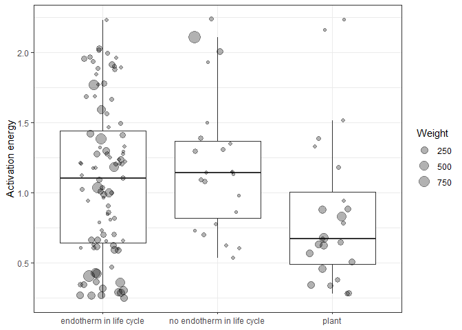<!-- -->

When we plot these groups as a function of mean annual temperature, we
then see that, at a given temperature, species exclusively infecting
ectotherms have higher AE. This pattern is not strong, but it is
consistent with the idea that environmental stability lowers AE
(endotherms provide a stable temperature for helminths).

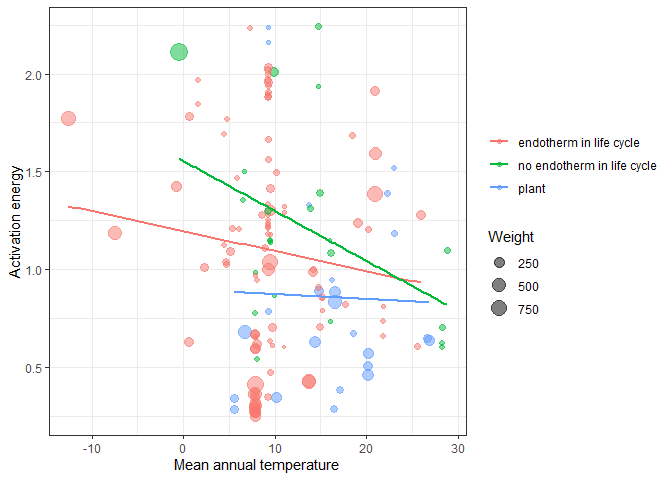<!-- -->

#### Stage in or out of host?

Stages inside a host may be more shielded from temperature variation
than stages in the environment. Let’s add this distinction to the model.

This term is not significant and the model DIC is worse.

    ## 
    ##  Iterations = 3001:62951
    ##  Thinning interval  = 50
    ##  Sample size  = 1200 
    ## 
    ##  DIC: 117.3856 
    ## 
    ##  G-structure:  ~binomial
    ## 
    ##          post.mean l-95% CI u-95% CI eff.samp
    ## binomial   0.02556 0.002509  0.07024      738
    ## 
    ##                ~tree_tips
    ## 
    ##           post.mean l-95% CI u-95% CI eff.samp
    ## tree_tips    0.4096   0.1051   0.7624    916.3
    ## 
    ##                ~idh(stderr_ss):units
    ## 
    ##                 post.mean l-95% CI u-95% CI eff.samp
    ## stderr_ss.units         1        1        1        0
    ## 
    ##  R-structure:  ~units
    ## 
    ##       post.mean l-95% CI u-95% CI eff.samp
    ## units   0.08985  0.06014   0.1224     1200
    ## 
    ##  Location effects: E_SS ~ mean_ann_temp_cen + dist_zone + habitat_d1 + endo_ecto2 + devo_type 
    ## 
    ##                                      post.mean l-95% CI u-95% CI eff.samp
    ## (Intercept)                            0.66033 -0.09889  1.33516     1200
    ## mean_ann_temp_cen                     -0.02687 -0.04281 -0.01132     1200
    ## dist_zonetemperate                    -0.03555 -0.35883  0.29719     1200
    ## dist_zonesubtropical                   0.44330  0.00355  0.88228     1200
    ## dist_zonetropical                      0.56400  0.03746  1.09583     1200
    ## dist_zoneglobal                        0.18471 -0.13953  0.52130     1200
    ## habitat_d1terrestrial                  0.41152  0.01053  0.80221     1200
    ## endo_ecto2no endotherm in life cycle   0.37440  0.09377  0.61508     1474
    ## endo_ecto2plant                       -0.03524 -0.66064  0.68382     1495
    ## devo_typeoutside host                  0.07746 -0.12674  0.29869     1309
    ##                                        pMCMC   
    ## (Intercept)                          0.08500 . 
    ## mean_ann_temp_cen                    0.00167 **
    ## dist_zonetemperate                   0.85833   
    ## dist_zonesubtropical                 0.04667 * 
    ## dist_zonetropical                    0.04833 * 
    ## dist_zoneglobal                      0.28333   
    ## habitat_d1terrestrial                0.04000 * 
    ## endo_ecto2no endotherm in life cycle 0.00333 **
    ## endo_ecto2plant                      0.88333   
    ## devo_typeoutside host                0.49167   
    ## ---
    ## Signif. codes:  0 '***' 0.001 '**' 0.01 '*' 0.05 '.' 0.1 ' ' 1

Though the difference is not significant, worms outside the host have
slightly higher AEs, which is also consistent with the idea that
environmental variation favors higher AE. The plot also shows that
habitat and in/outside host are conflated, as proportionally more of the
terrestrial values are outside the host and more of the aquatic values
are inside the host.

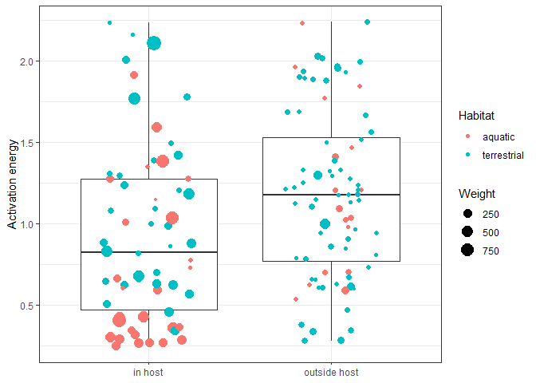<!-- -->

#### Target host

Stages free in the environment are generally propagules that target the
next host in the life cycle. Are the parasites targeting a vertebrate or
an invertebrate? It is not obvious to me that this should matter. But
nonetheless, we can check it.

Distinguishing between invertebrates and vertebrates as next host
slightly improves the model, but the contrasts are not significant.

    ## 
    ##  Iterations = 3001:62951
    ##  Thinning interval  = 50
    ##  Sample size  = 1200 
    ## 
    ##  DIC: 111.4113 
    ## 
    ##  G-structure:  ~binomial
    ## 
    ##          post.mean l-95% CI u-95% CI eff.samp
    ## binomial   0.02217 0.001743  0.06113    758.9
    ## 
    ##                ~tree_tips
    ## 
    ##           post.mean l-95% CI u-95% CI eff.samp
    ## tree_tips    0.4262  0.08216   0.7537    776.7
    ## 
    ##                ~idh(stderr_ss):units
    ## 
    ##                 post.mean l-95% CI u-95% CI eff.samp
    ## stderr_ss.units         1        1        1        0
    ## 
    ##  R-structure:  ~units
    ## 
    ##       post.mean l-95% CI u-95% CI eff.samp
    ## units   0.08549  0.05752   0.1169     1200
    ## 
    ##  Location effects: E_SS ~ mean_ann_temp_cen + dist_zone + habitat_d1 + endo_ecto2 + devo_type3 
    ## 
    ##                                            post.mean  l-95% CI  u-95% CI
    ## (Intercept)                                 0.673325 -0.013121  1.349298
    ## mean_ann_temp_cen                          -0.023837 -0.039330 -0.008207
    ## dist_zonetemperate                         -0.019343 -0.371808  0.298094
    ## dist_zonesubtropical                        0.309811 -0.148366  0.733995
    ## dist_zonetropical                           0.505394 -0.028917  0.997692
    ## dist_zoneglobal                             0.189187 -0.154198  0.512311
    ## habitat_d1terrestrial                       0.534520  0.121069  0.923610
    ## endo_ecto2no endotherm in life cycle        0.182850 -0.112029  0.493453
    ## endo_ecto2plant                            -0.101608 -0.848856  0.592912
    ## devo_type3in plant                         -0.155303 -0.521427  0.220771
    ## devo_type3outside host: targets invert      0.199013 -0.095527  0.495282
    ## devo_type3outside host: targets vertebrate -0.381555 -0.845300  0.055179
    ##                                            eff.samp  pMCMC   
    ## (Intercept)                                   808.2 0.0450 * 
    ## mean_ann_temp_cen                            1200.0 0.0050 **
    ## dist_zonetemperate                           1200.0 0.9067   
    ## dist_zonesubtropical                         1200.0 0.1833   
    ## dist_zonetropical                            1200.0 0.0617 . 
    ## dist_zoneglobal                              1200.0 0.2650   
    ## habitat_d1terrestrial                        1200.0 0.0100 * 
    ## endo_ecto2no endotherm in life cycle         1090.5 0.2433   
    ## endo_ecto2plant                              1200.0 0.7650   
    ## devo_type3in plant                           1200.0 0.3900   
    ## devo_type3outside host: targets invert       1000.3 0.1900   
    ## devo_type3outside host: targets vertebrate   1200.0 0.0883 . 
    ## ---
    ## Signif. codes:  0 '***' 0.001 '**' 0.01 '*' 0.05 '.' 0.1 ' ' 1

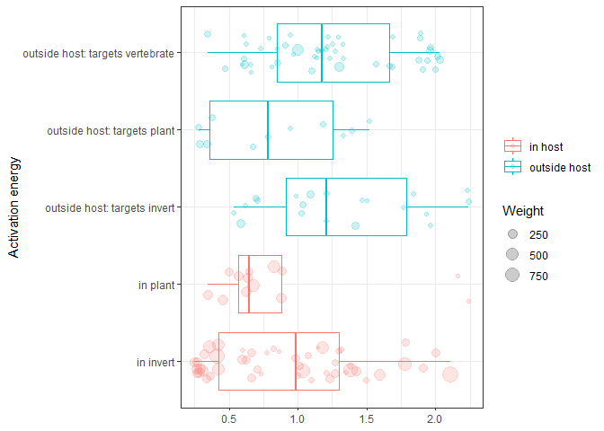<!-- -->

# Conclusions

In this analysis of activation energies in helminths, I account for
measurement variance (standard error of activation energy estimates) and
I account for two sources of pseudoreplication: (1) multiple
measurements on a single parasite species and (2) shared ancestry. A
mixed model including both factors suggested that shared ancestry has a
clear effect on AEs: related species tend to exhibit similar activation
energies.

Next, I evaluated various environmental characteristics and found that
activation energies tend to be higher at low temperatures and high
latitudes. Finally, I assessed characteristics of the host-parasite
interaction, and I found that animal parasites with endotherms in the
life cycle tend to have lower AE, consistent with the notion of
temperature stability affecting temperature sensitivities.

Finally, let’s quantitatively summarize the results. For each of the
fitted models, I compiled the df, the DIC, and the R2. I
calculated R2 according to [Nakagawa and
Schielzeth 2013](https://besjournals.onlinelibrary.wiley.com/doi/full/10.1111/j.2041-210x.2012.00261.x%4010.1111/%28ISSN%292041-210X.STATSTOO).
They distinguish between marginal and conditional R2.
Marginal R2 is the proportion of variation explained by the
fixed effects while conditional R2 is the variation explained
by both fixed and random effects. When the term is followed by an
asterisk, I retained it in the model.

| model                                 | df | df\_used |    DIC |  R2m |  R2c |
| :------------------------------------ | -: | -------: | -----: | ---: | ---: |
| just within-species\*                 |  3 |       NA | 160.65 | 0.00 | 0.56 |
| \+ phylogeny\*                        |  4 |        1 | 140.26 | 0.00 | 0.75 |
| \+ mean annual temp\*                 |  5 |        1 | 141.54 | 0.00 | 0.75 |
| \+ min/max temps                      |  7 |        2 | 142.83 | 0.01 | 0.72 |
| \+ latitude                           |  6 |      \-1 | 142.34 | 0.01 | 0.76 |
| \+ distribution zone\*                |  9 |        3 | 133.91 | 0.07 | 0.79 |
| \+ habitat (aquatic vs terrestrial)\* | 10 |        1 | 129.13 | 0.10 | 0.82 |
| \+ distribution x habitat interacton  | 13 |        3 | 131.78 | 0.12 | 0.83 |
| \+ plant vs animal parasite\*         | 11 |      \-2 | 129.00 | 0.13 | 0.84 |
| \+ endotherm in life cycle?\*         | 12 |        1 | 116.59 | 0.13 | 0.88 |
| \+ stage in/out of host\*             | 13 |        1 | 117.39 | 0.15 | 0.85 |
| \+ target host: invert vs vert        | 15 |        2 | 111.41 | 0.14 | 0.88 |

The most complex model, one that includes phylogeny, seemingly important
environmental variables, and characteristics of the host-parasite
system, explained over 89% of the variation in activation energy. Much
of this is due to the random effects (phylogeny and repeated measures
account for \>70% of the variation), but around 15% of the variation can
be explained by fixed effects.
