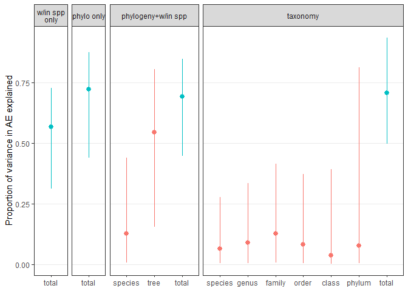
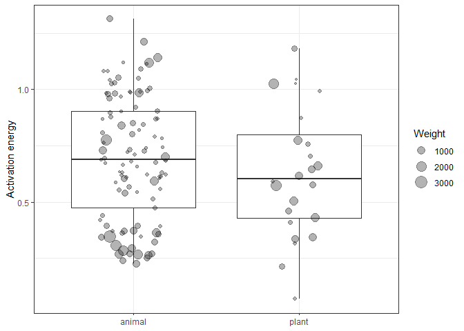

Determinants of helminth activation energy
================

-   [Get data organized](#get-data-organized)
    -   [The response - activation
        energy](#the-response---activation-energy)
    -   [Apparent parasite development - same experiment, different
        metrics](#apparent-parasite-development---same-experiment-different-metrics)
    -   [Phylogeny](#phylogeny)
-   [Phylogenetic mixed models](#phylogenetic-mixed-models)
    -   [Methodological issues and the “base”
        model](#methodological-issues-and-the-base-model)
        -   [Within-species effect](#within-species-effect)
        -   [Phylogenetic effect](#phylogenetic-effect)
    -   [Biological covariates of activation
        energy](#biological-covariates-of-activation-energy)
        -   [Environmental variables](#environmental-variables)
        -   [Host-parasite
            characteristics](#host-parasite-characteristics)
-   [Revisit taxonomic effects](#revisit-taxonomic-effects)
-   [Summary](#summary)
-   [Robustness to dropping SS fits](#robustness-to-dropping-ss-fits)
-   [Robustness to pseudoreplication](#robustness-to-pseudoreplication)
-   [Conclusions](#conclusions)

The purpose of this notebook is to explore and model activation energies
for helminth development. I previously explored activation energy for
both development and mortality. However, fitting thermal performance
curves to mortality data proved challenging, and we were not entirely
confident in the curve parameters. Therefore, we focus here just on
**development**.

Moreover, I had previously analyzed activation energies estimated with
Arrhenius or Sharp-Schoolfield curves separately. However, after
adopting more stringent criteria for when to consider SS the better
model, we were left with just a handful of curves where SS was
considered better. Therefore, in this notebook, I analyze activation
energies taken from the “best” curve (usually Arrhenius, sometimes SS).

# Get data organized

First, I get the data organized. I combine the curve parameters with the
main dataset including info for each parasite species and thermal
performance curve.

How many rows in the main data lack curve parameters?

    ## [1] 0

No worries there. Since this is a phylogenetic analysis, let’s next
check the congruence between tree and data table. Here are the species
in the data not included in the tree. This is the result of a spelling
mistake and after correcting it, all species are included in the tree.

    ## [1] "Meloidogyne_hispanica"

How many AE estimates are there for worm development?

    ## [1] 142

How many unique species are in the data?

    ## [1] 87

Tips on tree?

    ## [1] 87

Taxonomic breakdown

| phylum          | num\_sp |
|:----------------|--------:|
| Acanthocephala  |       3 |
| Nematoda        |      62 |
| Platyhelminthes |      22 |

### The response - activation energy

Now that the data are organized, we can look at the response variable,
activation energy. Activation energy was estimated from thermal
performance curves two ways, either with Arrhenius or Sharpe-Schoolfied
equations.

Which of these fit better was judged by likelihood ratio tests, and it
was an almost 50-50 split.

    ## 
    ##   BA   SS 
    ## 0.51 0.49

However, the estimates from the two models clearly differed, as shown by
the density plot below. When SS was considered better, the AE estimates
were higher. When Arr was considered better, the AE estimates were
lower. This is why I previously analyzed the Arr and SS estimates
separately.

<!-- -->

Looking at the curve fits, though, suggested that SS was sometimes
considered better even in cases where there was not a well defined peak
in the curve. To be sure that SS was an appropriate model, stricter
criteria were used. SS was only considered better when there were at
least 5 points in the curve and the curve had a clear peak with two
points beyond the peak. After applying these criteria, the proportion of
curves better fit by SS was much lower.

    ## 
    ##   BA   SS 
    ## 0.91 0.09

    ## 
    ##  BA  SS 
    ## 129  13

Here is the AE distribution. Overall, the median activation energy was
0.69. The few curves better fit by SS do not have obviously different
AEs.

<!-- -->

Some curves have more data points and are better fit than others.
Standard error take into account both the number of points in the curve
and the fit. Therefore, let’s look at standard errors as a way to weigh
data points (i.e. meta-analysis).

Here’s the distribution of standard error estimates for the activation
energies. There is at least one outlier where the curve fits poorly (it
is curve 237, which is characterized by a few unusual data points).

<!-- -->

The curves with high SE are not those with high activation energies.

<!-- -->

All else equal, we should have more confidence in curves fit with a
larger number of temperatures. To reflect this, standard error should
decrease with sample size (i.e. number of temperatures). But this is not
obviously the case.

<!-- -->

When we zoom in to exclude the outliers, there is still not a strong
relationship between standard error and the number of temperatures.
However, the largest standard errors are observed with the lowest sample
sizes (left-hand part of plot), which is reassuring.

<!-- -->

With less precision (higher standard errors), we would expect a broader
distribution of activation energy estimates. Let’s look at the
distribution of activation energies split by whether standard error was
high or low (above or below the median SE). The AE distribution is not
wider with higher standard errors, though it might be a bit shifted
towards higher values.

<!-- -->

Poorly fit curves (above average SE) had slightly higher median AE
compared to better fitting curves.

| se\_cat             | median\_AE | upr\_90quant | lwr\_90quant |
|:--------------------|-----------:|-------------:|-------------:|
| high standard error |  0.7636728 |     1.097199 |    0.3790765 |
| low standard error  |  0.5947639 |     1.130788 |    0.2572576 |

Thus, when we weight the data points by the standard error of the
activation energies, it should shift the overall mean down.

Here are some descriptives from the manuscript:

    ##    Min. 1st Qu.  Median    Mean 3rd Qu.    Max. 
    ##   4.000   4.250   6.000   6.915   7.000  16.000

## Apparent parasite development - same experiment, different metrics

In some cases, multiple TPCs were fit to data from the same experiment.
For example, one curve fit for minimum developmental time and one for
maximum developmental time. These are not independent because the same
individual parasites contribute to both metrics. In these cases AE
measurements should be highly correlated.

Let’s make a plot for the species with multiple activation energy
measurements. When we do this, we see that AE estimates from the same
experiment tend to cluster as expected.

<!-- -->

This indicates these values are not independent. Since this is an issue
that only affects a few species, I’m not inclined to devise an
`experiment` random effect that accounts for this pseudoreplication.
Rather, I only take a single AE per experiment. But which one?

We can zoom in on just these cases where there are multiple measurements
from the same experiment. There is a consistent pattern: activation
energy is higher when the metric is minimum development time than when
it is maximum development time.

<!-- -->

This also highlights the concerns Peter has raised about *apparent*
developmental rates, in that development is not measured for all viable
worms (ones that die before maturing are excluded). For instance,
mortality is probably more important if devo time is defined as the time
for the last parasite to reach a certain developmental milestone
(i.e. max devo time) than if it’s defined as the time for the first
parasite to reach the milestone (min devo time), because fewer parasite
have died and are unobserved.

We can examine how activation energy varies with the developmental
metric across the whole dataset. It does not follow the same pattern as
within an experiment. For example, the ‘max’ group is higher than the
‘min’ group overall, while this was reversed within experiments.

<!-- -->

Overall, most activation energies were based on mean development times.
Thus, in the few cases where multiple TPCs were fit to data from the
same experiment, but different metrics, I will retain only the
activation energy estimated with the mean.

After removing AEs from the same experiment, how many AE estimates per
species? Usually just one, but up to 8.

    ##        n        
    ##  Min.   :1.000  
    ##  1st Qu.:1.000  
    ##  Median :1.000  
    ##  Mean   :1.483  
    ##  3rd Qu.:2.000  
    ##  Max.   :8.000

In some cases, the source of repeated measures on a single species was
recorded. For example, the temperature dependence of multiple parasite
populations or life stages was studied. We can also plot these variables
the same way as above. I do not notice any obvious patterns.

<!-- -->

Since life stages or populations of the same parasite species may have
different temperature sensitivities, I would retain these in the data.

## Phylogeny

To visualize phylogenetic effects, I’ll randomly take one AE per
species.

This reduces the data from n = 129 to n = 87. Here is the distribution
of activation energies across the tree. Maybe some clades have higher
values, but it is not obvious. The cases where SS was chosen as the
better model are not bunched into a single clade, suggesting they will
not confound or exacerbate phylogenetic effects.

<!-- -->

# Phylogenetic mixed models

I’ll fit phylogenetic mixed models (see
[here](https://onlinelibrary.wiley.com/doi/full/10.1111/j.1420-9101.2009.01915.x)
for an overview of these models) using the `MCMCglmm` library. These are
not simple models, but the Bayesian `MCMCglmm` package does allow us to
fit both within- and between-species effects in the same model. It also
allows us to weight the activation energies by their standard errors.

Before diving into the models, though, let’s outline a model-building
strategy. I see two major steps: (1) addressing methological concerns
and (2) exploring biological covariates. Let’s consider the
methodological concerns first. From the outset, I weight each data point
by the standard error of activation energy. This weight was incorporated
into the model as suggested
[here](https://ourcodingclub.github.io/2018/01/22/mcmcglmm.html) and in
the `MCMCglmm` course notes. There are also two sources of
pseudoreplication: within-species and between-species variation. Some
species have multiple AE estimates (e.g. from different hosts, studies,
populations, stages, etc.), while related species are expected to have
similar AEs, given their shared ancestry. Both these are included as
random effects. Other methodological concerns are addressed with fixed
effects, such as how rates were recorded (e.g. min, max, etc.).

Now that we are at the modeling stage, let’s also list a few
descriptives.

Number of curves:

    ## [1] 129

Number of species

    ## [1] 87

Number of temps per curve

    ##    Min. 1st Qu.  Median    Mean 3rd Qu.    Max. 
    ##   4.000   4.000   6.000   6.845   7.000  16.000

Number fit by each model:

    ## 
    ##  BA  SS 
    ## 116  13

    ## 
    ##  BA  SS 
    ## 0.9 0.1

Median activation energy

    ##    Min. 1st Qu.  Median    Mean 3rd Qu.    Max. 
    ## 0.06908 0.43963 0.67499 0.68278 0.90192 1.31323

## Methodological issues and the “base” model

### Within-species effect

First, I create a “base” model that accounts for pseudoreplication. The
first step towards that model is including a parasite species random
effect, but not a phylogenetic effect. Throughout, data points are
weighted by their standard error.

After fitting an MCMC model, a first quality check is looking at chain
mixing. Essentially, we want the chain to bounce back and forth randomly
- it shouldn’t get stuck at particular parameter estimates.

<!-- -->

The within-species effect, `binomial`, mixes well and is non-zero,
suggesting that multiple AE measurements on the same species tend to be
similar. The variance component for `se` is fixed at 1, such that the
standard error weights do not change as the posterior distribution is
sampled by the Markov chain.

Here is the model summary. The model intercept represents the average
activation energy.

    ## 
    ##  Iterations = 3001:12991
    ##  Thinning interval  = 10
    ##  Sample size  = 1000 
    ## 
    ##  DIC: -23.52041 
    ## 
    ##  G-structure:  ~binomial
    ## 
    ##          post.mean l-95% CI u-95% CI eff.samp
    ## binomial   0.04153  0.02066  0.06616     1030
    ## 
    ##                ~idh(se_comb):units
    ## 
    ##               post.mean l-95% CI u-95% CI eff.samp
    ## se_comb.units         1        1        1        0
    ## 
    ##  R-structure:  ~units
    ## 
    ##       post.mean l-95% CI u-95% CI eff.samp
    ## units    0.0324  0.01914  0.04561    858.5
    ## 
    ##  Location effects: E_comb ~ 1 
    ## 
    ##             post.mean l-95% CI u-95% CI eff.samp  pMCMC    
    ## (Intercept)    0.6962   0.6424   0.7499     1000 <0.001 ***
    ## ---
    ## Signif. codes:  0 '***' 0.001 '**' 0.01 '*' 0.05 '.' 0.1 ' ' 1

The information criteria returned by `MCMCglmm` is the Deviance
Information Criterion (DIC). We can use it to compare models. Judged on
DIC, adding a within-species random effect is a clear improvement.

    ## Delta DIC, intercept-only model vs model with within-species random effect (higher is better):   61.93683

Here’s the proportion of variation attributable to the within-species
effect.

    ## 
    ## Iterations = 3001:12991
    ## Thinning interval = 10 
    ## Number of chains = 1 
    ## Sample size per chain = 1000 
    ## 
    ## 1. Empirical mean and standard deviation for each variable,
    ##    plus standard error of the mean:
    ## 
    ##           Mean             SD       Naive SE Time-series SE 
    ##       0.555882       0.103239       0.003265       0.003424 
    ## 
    ## 2. Quantiles for each variable:
    ## 
    ##   2.5%    25%    50%    75%  97.5% 
    ## 0.3131 0.4926 0.5672 0.6309 0.7267

It is definitely non-zero and suggests that species measured multiple
times tend to have very similar AE estimates, although there is a fairly
wide spread in the estimated AEs for some species.

<!-- -->

The `species` effect is also likely inflated because many species only
had a single measurement (and hence no residual value after accounting
for a ‘species effect’).

### Phylogenetic effect

Now, let’s add phylogenetic effects to the model to examine variation
between species. We create the phylogenetic covariance matrix and then
include it as a random effect.

For this model, the chain needs to be run for longer to get reasonable
mixing, partly because the two random effects are related. If the model
estimates higher values for the within-species variance component, it
estimates less for the phylogenetic component, and vice versa.

After fitting, we can again plot the chains. They look ok. The
within-species effect (`binomial`) is closer to zero than the
phylogenetic effect (`tree_tips`).

<!-- -->

These results suggest that phylogenetically related species tend to have
similar AEs, and when a species is measured multiple times, the
estimated AEs are similar, though they are not far more similar than
what they are expected to be based on phylogeny (i.e. the within-species
effect does not explain much additional variation beyond phylogeny).

Here is the amount of variation around the mean AE attributed to the
phylogenetic effect. It is high, but with wide credible intervals.

    ## 
    ## Iterations = 3001:102951
    ## Thinning interval = 50 
    ## Number of chains = 1 
    ## Sample size per chain = 2000 
    ## 
    ## 1. Empirical mean and standard deviation for each variable,
    ##    plus standard error of the mean:
    ## 
    ##           Mean             SD       Naive SE Time-series SE 
    ##       0.526109       0.177007       0.003958       0.005975 
    ## 
    ## 2. Quantiles for each variable:
    ## 
    ##   2.5%    25%    50%    75%  97.5% 
    ## 0.1555 0.4013 0.5455 0.6674 0.8054

By contrast, the ‘species’ effect explained less of the variation in AE.

    ## 
    ## Iterations = 3001:102951
    ## Thinning interval = 50 
    ## Number of chains = 1 
    ## Sample size per chain = 2000 
    ## 
    ## 1. Empirical mean and standard deviation for each variable,
    ##    plus standard error of the mean:
    ## 
    ##           Mean             SD       Naive SE Time-series SE 
    ##       0.154817       0.118627       0.002653       0.004157 
    ## 
    ## 2. Quantiles for each variable:
    ## 
    ##     2.5%      25%      50%      75%    97.5% 
    ## 0.008403 0.058089 0.129013 0.222059 0.440792

Thus far, the models suggest that (i) species measured multiple times
have similar AE values and (ii) related species have similar AE values.
Accordingly, adding the phylogenetic random effect to the model with
just within-species variation is an improvement.

    ## Delta DIC, within-species random effect vs phylogenetic random effect (higher is better):    7.929767

We can further decompose these effects by fitting a taxonomic mixed
model instead of a phylogenetic one. Specifically, instead of the
phylogeny, we have nested taxonomic random effects. This let’s us
explore whether phylogenetic structure is at the tips (i.e. differences
between genera) or the root of the tree (differences between phyla).

After fitting the model, we want to compare the estimated variance
component for each taxonomic level. To make the variance components
easier to interpret, we express them as a proportion of the total
variance. For example, the variance accounted for by “genus” is the
genus variance component divided by the summed taxonomic and residual
variance components. We’ll also compare taxonomic and phylogenetic
models, just in case some of the nodes in the phylogeny are especially
important (a phylogenetic tree is more resolved than a taxonomic one).

The total variation explained by the phylogenetic and taxonomic models
were quite similar, suggesting we would not lose much by using taxonomy
instead of phylogeny. It was also higher than in the model with just the
within-species effect, suggesting higher taxonomic groupings also
explain variation in AE. The largest taxonomic effect was for families,
suggesting differences between families and similarity within them.
However, the differences among taxonomic levels were small and quite
variable, which is expected given that their effects are nested and thus
confounded with each other.

<!-- -->

Here is the variance explained by phylogeny:

|    vc.lwr |    vc.fit |    vc.upr | t\_level | model      |
|----------:|----------:|----------:|:---------|:-----------|
| 0.4406458 | 0.7212456 | 0.8746044 | total    | phylo only |

and by taxonomy:

|   vc.lwr |    vc.fit |    vc.upr | t\_level | model    |
|---------:|----------:|----------:|:---------|:---------|
| 0.497187 | 0.7079735 | 0.9346937 | total    | taxonomy |

Here are the variance components for each taxonomic levels:

|    vc.lwr |    vc.fit |    vc.upr | t\_level | model    |
|----------:|----------:|----------:|:---------|:---------|
| 0.0056853 | 0.0663672 | 0.2781823 | species  | taxonomy |
| 0.0056937 | 0.0919481 | 0.3349400 | genus    | taxonomy |
| 0.0078911 | 0.1293643 | 0.4156930 | family   | taxonomy |
| 0.0054035 | 0.0822475 | 0.3717137 | order    | taxonomy |
| 0.0036472 | 0.0389814 | 0.3937445 | class    | taxonomy |
| 0.0059461 | 0.0785134 | 0.8118239 | phylum   | taxonomy |
| 0.4971870 | 0.7079735 | 0.9346937 | total    | taxonomy |

Here’s a plot splitting AE by parasite family. It does look like some
clades tend to have higher or lower AEs. However, some differences might
just be species-level effects, given that sometimes there is just one AE
estimate for the family.

<!-- -->

Let’s proceed with the model that includes both a phylogenetic effect,
given that it is more resolved than taxonomy, and a within-species
effect, as it acknowledges the non-independence in the data, even if it
overlaps with the phylogenetic effect. Now we can examine some other
methodological covariates.

#### Development metric

The chosen metric of development can affect activation energy estimates,
at least within experiments. This was less clear across experiments. To
check this effect, I added a fixed factor to the model that
distinguishes between activation estimates based on mean, min, or
unspecific development times.

The differences among metrics were minimal (non-significant p-values).

    ## 
    ##  Iterations = 3001:102951
    ##  Thinning interval  = 50
    ##  Sample size  = 2000 
    ## 
    ##  DIC: -26.71952 
    ## 
    ##  G-structure:  ~binomial
    ## 
    ##          post.mean  l-95% CI u-95% CI eff.samp
    ## binomial   0.01251 0.0002178  0.03059    922.2
    ## 
    ##                ~tree_tips
    ## 
    ##           post.mean l-95% CI u-95% CI eff.samp
    ## tree_tips   0.06151 0.006987   0.1344     1064
    ## 
    ##                ~idh(se_comb):units
    ## 
    ##               post.mean l-95% CI u-95% CI eff.samp
    ## se_comb.units         1        1        1        0
    ## 
    ##  R-structure:  ~units
    ## 
    ##       post.mean l-95% CI u-95% CI eff.samp
    ## units   0.03385  0.02082  0.04699     2000
    ## 
    ##  Location effects: E_comb ~ simplified_metric 
    ## 
    ##                                      post.mean l-95% CI u-95% CI eff.samp
    ## (Intercept)                            0.69548  0.44872  0.94527     2000
    ## simplified_metricmin                   0.02964 -0.06423  0.13612     2000
    ## simplified_metricother/not specified   0.09990 -0.04923  0.25031     2000
    ##                                       pMCMC    
    ## (Intercept)                          <5e-04 ***
    ## simplified_metricmin                  0.555    
    ## simplified_metricother/not specified  0.184    
    ## ---
    ## Signif. codes:  0 '***' 0.001 '**' 0.01 '*' 0.05 '.' 0.1 ' ' 1

Thus, it is not clear how valuable the `metric` term is. It does not
“correct” activation energies in the direction we would expect, it is
very weakly related to AE, and it does not improve the model, as judged
by DIC.

    ## Delta DIC, model with vs without 'metric' (higher is better):    -4.730655

Therefore, I have not included `metric` in further analyses.

## Biological covariates of activation energy

Now, I add biologically interesting variables to the base model. I
categorize these variables into two groups: (1) characteristics of the
external environment and (2) characteristics of the host-parasite
system. We’ll start with environmental variables.

### Environmental variables

Although we now examine environmental covariates, it is important to
keep phylogeny in mind. Essentially, any explanatory variable that is
phylogenetically structured will “compete” with the phylogenetic random
effect to explain variation in AE.

I have tried to find a series of logical steps to testing environmental
correlates of helminth AE. First and foremost, we expect AE to be
related to environmental temperature, so I start with temperature
variables.

#### Mean temperature

There are three temperature measurements in the data: mean, max, and min
for the location. I would expect the three temp variables to be tightly
correlated, so let’s start by just adding the mean to the model. Note
that I have centered the continuous variables around their median, such
that the model parameters are estimated at the data’s median annual
temperature.

The effect of mean locale temperature is negative but not quite
significant.

    ## 
    ##  Iterations = 3001:102951
    ##  Thinning interval  = 50
    ##  Sample size  = 2000 
    ## 
    ##  DIC: -30.84113 
    ## 
    ##  G-structure:  ~binomial
    ## 
    ##          post.mean  l-95% CI u-95% CI eff.samp
    ## binomial    0.0153 0.0003993  0.03296     1027
    ## 
    ##                ~tree_tips
    ## 
    ##           post.mean l-95% CI u-95% CI eff.samp
    ## tree_tips   0.05337 0.002965   0.1166     1049
    ## 
    ##                ~idh(se_comb):units
    ## 
    ##               post.mean l-95% CI u-95% CI eff.samp
    ## se_comb.units         1        1        1        0
    ## 
    ##  R-structure:  ~units
    ## 
    ##       post.mean l-95% CI u-95% CI eff.samp
    ## units   0.03258  0.02135  0.04716     1853
    ## 
    ##  Location effects: E_comb ~ mean_ann_temp_cen 
    ## 
    ##                   post.mean  l-95% CI  u-95% CI eff.samp  pMCMC    
    ## (Intercept)        0.714865  0.476248  0.959862     2000 <5e-04 ***
    ## mean_ann_temp_cen -0.005499 -0.012833  0.001136     2000  0.118    
    ## ---
    ## Signif. codes:  0 '***' 0.001 '**' 0.01 '*' 0.05 '.' 0.1 ' ' 1

The model fit is not better as judged by DIC.

    ## Delta DIC, model with vs without mean temp (higher is better):   -0.6090483

Here’s the plot. Each point is scaled by its weight (inverse SE).

<!-- -->

Another issue to consider, though, is that exact sampling locations were
not available for every species and in many cases the author’s address
was taken as the study location. These data points may therefore be
expected to be less correlated with AE, as seems to be the case.

<!-- -->

Let’s try to add this to the model. We allow temperature effects to
depend on whether an exact sampling location was known.

This does not clearly improve the model, as judged by DIC.

    ## Delta DIC, mean temp main effect vs temp x location interaction (higher is better):  -0.9331661

Here’s the model output:

    ## 
    ##  Iterations = 3001:102951
    ##  Thinning interval  = 50
    ##  Sample size  = 2000 
    ## 
    ##  DIC: -29.90796 
    ## 
    ##  G-structure:  ~binomial
    ## 
    ##          post.mean  l-95% CI u-95% CI eff.samp
    ## binomial   0.01529 0.0003528  0.03224     1001
    ## 
    ##                ~tree_tips
    ## 
    ##           post.mean l-95% CI u-95% CI eff.samp
    ## tree_tips   0.05524 0.002783   0.1193     1150
    ## 
    ##                ~idh(se_comb):units
    ## 
    ##               post.mean l-95% CI u-95% CI eff.samp
    ## se_comb.units         1        1        1        0
    ## 
    ##  R-structure:  ~units
    ## 
    ##       post.mean l-95% CI u-95% CI eff.samp
    ## units   0.03257  0.01848  0.04529     1610
    ## 
    ##  Location effects: E_comb ~ mean_ann_temp_cen * sampling_location_available 
    ## 
    ##                                                         post.mean  l-95% CI
    ## (Intercept)                                              0.720052  0.455596
    ## mean_ann_temp_cen                                       -0.011430 -0.022682
    ## sampling_location_availableyes, exact                   -0.009899 -0.125698
    ## mean_ann_temp_cen:sampling_location_availableyes, exact  0.008801 -0.006122
    ##                                                          u-95% CI eff.samp
    ## (Intercept)                                              0.958557     1991
    ## mean_ann_temp_cen                                        0.001237     2087
    ## sampling_location_availableyes, exact                    0.095429     2000
    ## mean_ann_temp_cen:sampling_location_availableyes, exact  0.023158     2000
    ##                                                          pMCMC    
    ## (Intercept)                                             <5e-04 ***
    ## mean_ann_temp_cen                                        0.067 .  
    ## sampling_location_availableyes, exact                    0.858    
    ## mean_ann_temp_cen:sampling_location_availableyes, exact  0.234    
    ## ---
    ## Signif. codes:  0 '***' 0.001 '**' 0.01 '*' 0.05 '.' 0.1 ' ' 1

Given that temp is a main focus of the analysis, let’s continue with a
model including temperature but not its interactions.

#### Temperature variation

A mean temperature does not indicate the temperature range a parasite is
exposed to. Thus, as the next modelling step, we’ll include location min
and max temps.

None of these terms are significant, and the model DIC is not better.

    ## 
    ##  Iterations = 3001:102951
    ##  Thinning interval  = 50
    ##  Sample size  = 2000 
    ## 
    ##  DIC: -29.58968 
    ## 
    ##  G-structure:  ~binomial
    ## 
    ##          post.mean  l-95% CI u-95% CI eff.samp
    ## binomial   0.01523 0.0002642  0.03204     1006
    ## 
    ##                ~tree_tips
    ## 
    ##           post.mean l-95% CI u-95% CI eff.samp
    ## tree_tips   0.05303 0.004121   0.1218     1052
    ## 
    ##                ~idh(se_comb):units
    ## 
    ##               post.mean l-95% CI u-95% CI eff.samp
    ## se_comb.units         1        1        1        0
    ## 
    ##  R-structure:  ~units
    ## 
    ##       post.mean l-95% CI u-95% CI eff.samp
    ## units   0.03262   0.0202  0.04694     2000
    ## 
    ##  Location effects: E_comb ~ mean_ann_temp_cen + max_month_temp_cen + min_month_temp_cen 
    ## 
    ##                    post.mean  l-95% CI  u-95% CI eff.samp  pMCMC    
    ## (Intercept)         0.638856  0.372481  0.887071     2320 <5e-04 ***
    ## mean_ann_temp_cen   0.033518 -0.028857  0.099991     2000  0.311    
    ## max_month_temp_cen -0.020222 -0.058399  0.015785     2000  0.300    
    ## min_month_temp_cen -0.020394 -0.053072  0.009795     2000  0.187    
    ## ---
    ## Signif. codes:  0 '***' 0.001 '**' 0.01 '*' 0.05 '.' 0.1 ' ' 1

    ## Delta DIC, mean temp main effect vs model with min and max temp (higher is better):  -1.25145

When we plot AE as a function of max and min temp, we see negative
relationships just like for mean temp: low temps, high AE. The
interaction with location coding may be a bit different, but I chose not
to look at the interaction betwen location, max, and min temps, given
that they probably overlap a lot with mean temperature.

<!-- -->

<!-- -->

Is there a good biological reason to include extreme temps in the model?
On the one hand, we could expect that temperature variability affects
activation energy. On the other hand, a lower min temperature might not
matter much if parasites do not develop below a certain threshold that
is unlinked to the minimum temperature. Also, if temperature variability
is what drives activation energy, then we would expect the parameter
estimates for min and max to go in opposite directions, i.e. larger
temperature extremes are associated with higher (or lower) AE values.
Since (i) these results are confounded with mean temperature and (ii) we
test several other proxies of seasonality/temperature variability, my
preference is to drop min and max temp from the model.

#### Seasonality

Variation in temperature is one component of seasonality, but not the
only one. Photoperiod, rainfall, or other environmental factors may vary
with seasons and impact the thermal-dependence of parasite development.
The dataset contains two variables that might capture seasonality:
latitude and distribution. Distribution zones were defined as ‘tropics’,
‘temperate’, ‘polar’, and ‘global’, which means this variable overlaps
substantially with latitude. Consequently, I examine these two variables
in parallel, not putting both in the same model.

##### Latitude

Let’s look at latitude first; it is a single continuous variable while
distribution is multiple categories. In some cases, a study gave a
detailed location, so our data contains exact latitudes. In other cases,
no site was given and the author’s location was taken as a rough proxy
of the study’s location. Most records were from the Northern hemisphere,
but a few were from the Southern hemisphere. Thus, I took the absolute
value of latitude, essentially the distance from the equator.

The effect of latitude on AE is not significant…

    ## 
    ##  Iterations = 3001:102951
    ##  Thinning interval  = 50
    ##  Sample size  = 2000 
    ## 
    ##  DIC: -28.61267 
    ## 
    ##  G-structure:  ~binomial
    ## 
    ##          post.mean  l-95% CI u-95% CI eff.samp
    ## binomial   0.01475 0.0003548  0.03196    967.6
    ## 
    ##                ~tree_tips
    ## 
    ##           post.mean l-95% CI u-95% CI eff.samp
    ## tree_tips   0.04635 0.002251   0.1058    992.7
    ## 
    ##                ~idh(se_comb):units
    ## 
    ##               post.mean l-95% CI u-95% CI eff.samp
    ## se_comb.units         1        1        1        0
    ## 
    ##  R-structure:  ~units
    ## 
    ##       post.mean l-95% CI u-95% CI eff.samp
    ## units   0.03333  0.02165  0.04766     1743
    ## 
    ##  Location effects: E_comb ~ mean_ann_temp_cen + lat_abs_cen 
    ## 
    ##                    post.mean   l-95% CI   u-95% CI eff.samp  pMCMC    
    ## (Intercept)        0.7014892  0.4843592  0.9370625     2000 <5e-04 ***
    ## mean_ann_temp_cen -0.0142555 -0.0269711 -0.0009826     2000  0.038 *  
    ## lat_abs_cen       -0.0053374 -0.0122586  0.0008675     1866  0.110    
    ## ---
    ## Signif. codes:  0 '***' 0.001 '**' 0.01 '*' 0.05 '.' 0.1 ' ' 1

…and not an improvement as judged by DIC.

    ## Delta DIC, mean temp main effect vs model with latitude added (higher is better):    -2.22846

Surprisingly, the parameter estimate for latitude is negative, but when
we plot it, we see that activation energies tend to slightly increase
with latitude, as we would expect given the temp results above.

<!-- -->

This suggests that correlations among variables (here between mean temp
and latitude) might cause counterintuitive results. When we remove the
effect of mean temperature on activation energy (i.e. we take the
residuals of the model with mean temp but not latitude), and then plot
the residual variation as a function of latitude, we see essentially no
relationship between latitude and activation energy.

<!-- -->

Latitude effects, like temp, may depend on trait and location
availability. When we plot this, we see a bit clearer increase in AE
with latitude, when the location was precisely known.

<!-- -->

However, adding this interaction was not a clear improvement to the
model.

    ## Delta DIC, latitude main effect vs latitude x location interaction (higher is better):   -1.048053

Let’s look at the next seasonality proxy, which is related to latitude.

##### Climate zones

Our latitude variable does not perfectly capture a parasite’s thermal
habitat. Many species are associated with people or livestock and have
thus been moved all around the world. This is reflected in the
distribution zone variable: it contains a category for parasites with a
global distribution.

However, the distribution categories are still tightly linked to
latitude.

<!-- -->

Let’s add this variable to the model instead of latitude. None of the
contrasts among these categories are significant.

    ## 
    ##  Iterations = 3001:102951
    ##  Thinning interval  = 50
    ##  Sample size  = 2000 
    ## 
    ##  DIC: -30.99668 
    ## 
    ##  G-structure:  ~binomial
    ## 
    ##          post.mean  l-95% CI u-95% CI eff.samp
    ## binomial   0.01924 0.0004773  0.03713     1265
    ## 
    ##                ~tree_tips
    ## 
    ##           post.mean l-95% CI u-95% CI eff.samp
    ## tree_tips   0.04509 0.001346   0.1076    791.2
    ## 
    ##                ~idh(se_comb):units
    ## 
    ##               post.mean l-95% CI u-95% CI eff.samp
    ## se_comb.units         1        1        1        0
    ## 
    ##  R-structure:  ~units
    ## 
    ##       post.mean l-95% CI u-95% CI eff.samp
    ## units   0.03143   0.0188  0.04409     1878
    ## 
    ##  Location effects: E_comb ~ mean_ann_temp_cen + dist_zone 
    ## 
    ##                    post.mean  l-95% CI  u-95% CI eff.samp  pMCMC    
    ## (Intercept)         0.754594  0.539022  0.982675     1859 <5e-04 ***
    ## mean_ann_temp_cen  -0.007279 -0.015795  0.001911     2000  0.114    
    ## dist_zonepolar      0.051203 -0.280736  0.340703     2000  0.781    
    ## dist_zonetemperate -0.075302 -0.189228  0.047388     2000  0.224    
    ## dist_zonetropical   0.018469 -0.171186  0.226725     2000  0.843    
    ## ---
    ## Signif. codes:  0 '***' 0.001 '**' 0.01 '*' 0.05 '.' 0.1 ' ' 1

Accordingly, the model was not a clear improvement.

    ## Delta DIC, mean temp main effect vs model with latitude added (higher is better):    0.1555507

Consistent with the pattern for temperature and latitude, polar species
tend to have higher AE, but the other groups are all rather similar.

<!-- -->

The main difference between the latitude and zone variables is that zone
acknowledges some parasite species are globally distributed. Let’s again
look at the effect of latitude, but now distinguish between
globally-distributed species and more localized ones.

The latitude-AE relationship is similar for global and local parasites,
though I would have expected a weaker relationship for global species.

<!-- -->

Surprisingly, allowing the latitude effect to depend on distribution
(global vs not global) slightly improves the model.

    ## Delta DIC, latitude main effect vs latitude x global interaction (higher is better): 3.263195

But when we look at the model summary, the latitude and distribution
parameters are not significant.

    ## 
    ##  Iterations = 3001:102951
    ##  Thinning interval  = 50
    ##  Sample size  = 2000 
    ## 
    ##  DIC: -31.87586 
    ## 
    ##  G-structure:  ~binomial
    ## 
    ##          post.mean  l-95% CI u-95% CI eff.samp
    ## binomial   0.01743 0.0003537  0.03395     1266
    ## 
    ##                ~tree_tips
    ## 
    ##           post.mean l-95% CI u-95% CI eff.samp
    ## tree_tips    0.0444  0.00359   0.1094     1124
    ## 
    ##                ~idh(se_comb):units
    ## 
    ##               post.mean l-95% CI u-95% CI eff.samp
    ## se_comb.units         1        1        1        0
    ## 
    ##  R-structure:  ~units
    ## 
    ##       post.mean l-95% CI u-95% CI eff.samp
    ## units   0.03125  0.01938  0.04372     2000
    ## 
    ##  Location effects: E_comb ~ mean_ann_temp_cen + lat_abs_cen * global 
    ## 
    ##                              post.mean  l-95% CI  u-95% CI eff.samp  pMCMC    
    ## (Intercept)                   0.752205  0.509977  0.981573     2000 <5e-04 ***
    ## mean_ann_temp_cen            -0.018163 -0.031155 -0.004544     2000  0.015 *  
    ## lat_abs_cen                  -0.003850 -0.011140  0.002993     2000  0.271    
    ## globalnot global             -0.092278 -0.208982  0.021359     2179  0.130    
    ## lat_abs_cen:globalnot global -0.005541 -0.012822  0.001879     2000  0.141    
    ## ---
    ## Signif. codes:  0 '***' 0.001 '**' 0.01 '*' 0.05 '.' 0.1 ' ' 1

Nonetheless, I’ll retain the latitude by global distribution interaction
in the model, simply because it seems like a reasonable proxy for
seasonality, at least *a priori*. However, the latitude parameter is
hard to interpret (negative?), it is confounded with temperature, and it
does not seem to differ for globally-distributed species vs local ones.

#### Habitat - aquatic vs freshwater

As a final environmental variable, we add parasite habitat: aquatic vs
terrestrial. Water dampens temperature swings, such that seasonality is
less pronounced in aquatic habitats compared to terrestrial ones. Thus,
this variable might also modify the effect of seasonality proxies like
latitude.

Adding habitat clearly improves the model.

    ## Delta DIC, adding habitat (higher is better):    8.61052

The parameter indicates terrestrial species have higher activation
energies on average than aquatic species (mostly freshwater species, but
a few marine).

    ## 
    ##  Iterations = 3001:102951
    ##  Thinning interval  = 50
    ##  Sample size  = 2000 
    ## 
    ##  DIC: -40.48638 
    ## 
    ##  G-structure:  ~binomial
    ## 
    ##          post.mean  l-95% CI u-95% CI eff.samp
    ## binomial  0.007842 0.0002373  0.02277    904.5
    ## 
    ##                ~tree_tips
    ## 
    ##           post.mean l-95% CI u-95% CI eff.samp
    ## tree_tips   0.09338 0.005623   0.1806     1069
    ## 
    ##                ~idh(se_comb):units
    ## 
    ##               post.mean l-95% CI u-95% CI eff.samp
    ## se_comb.units         1        1        1        0
    ## 
    ##  R-structure:  ~units
    ## 
    ##       post.mean l-95% CI u-95% CI eff.samp
    ## units   0.02947  0.01867  0.04015     2000
    ## 
    ##  Location effects: E_comb ~ mean_ann_temp_cen + lat_abs_cen * global + habitat_d1 
    ## 
    ##                               post.mean   l-95% CI   u-95% CI eff.samp pMCMC
    ## (Intercept)                   6.448e-01  2.993e-01  9.524e-01     2000 0.001
    ## mean_ann_temp_cen            -1.965e-02 -3.388e-02 -6.716e-03     1631 0.002
    ## lat_abs_cen                  -3.491e-03 -1.087e-02  2.806e-03     2000 0.304
    ## globalnot global             -6.161e-02 -1.734e-01  6.084e-02     1867 0.309
    ## habitat_d1terrestrial         2.664e-01  4.960e-02  5.343e-01     1382 0.023
    ## lat_abs_cen:globalnot global -6.995e-03 -1.475e-02 -4.486e-05     2000 0.061
    ##                                 
    ## (Intercept)                  ***
    ## mean_ann_temp_cen            ** 
    ## lat_abs_cen                     
    ## globalnot global                
    ## habitat_d1terrestrial        *  
    ## lat_abs_cen:globalnot global .  
    ## ---
    ## Signif. codes:  0 '***' 0.001 '**' 0.01 '*' 0.05 '.' 0.1 ' ' 1

Here’s the plot.

<!-- -->

We might expect the aquatic - terrestrial dichotomy to be particularly
important in more seasonal locations. That is, there may be an
interaction between our seasonality proxy (latitude) and habitat. The
increase in AE with latitude mainly occurs in terrestrial species, which
makes sense, as terrestrial environments are less temperature buffered
than aquatic ones.

<!-- -->

However, adding this interaction to the model is not an improvement.

    ## Delta DIC, habitat main vs habitat x latitude interaction (higher is better):    -0.2138751

Now we have tested all the environmental variables. To summarize, AE
tends to be higher with low mean locale temperatures and in terrestrial
habitats.

### Host-parasite characteristics

Now, we turn to variables describing the host-parasite interaction. I
consider a few: (1) host type, (2) stage in or out of host, and (3)
target host. Compared to the environmental variables, these variables
are not as obviously confounded with each other.

#### Plant vs animal parasite

A major dichotomy is between between plant and animal parasites. This
might be relevant if plant and animal hosts have different activation
energies or if they differ in how much they ‘protect’ parasites from
temperature variation.

Plant parasites have lower AE than animal parasites, but the contrast is
not significant. Also, I imagine this distinction is strongly conflated
with phylogeny.

    ## 
    ##  Iterations = 3001:102951
    ##  Thinning interval  = 50
    ##  Sample size  = 2000 
    ## 
    ##  DIC: -41.04106 
    ## 
    ##  G-structure:  ~binomial
    ## 
    ##          post.mean  l-95% CI u-95% CI eff.samp
    ## binomial  0.006727 0.0001973  0.02052    911.8
    ## 
    ##                ~tree_tips
    ## 
    ##           post.mean l-95% CI u-95% CI eff.samp
    ## tree_tips    0.1055  0.01374   0.1985     1199
    ## 
    ##                ~idh(se_comb):units
    ## 
    ##               post.mean l-95% CI u-95% CI eff.samp
    ## se_comb.units         1        1        1        0
    ## 
    ##  R-structure:  ~units
    ## 
    ##       post.mean l-95% CI u-95% CI eff.samp
    ## units   0.02931   0.0185  0.04083     1851
    ## 
    ##  Location effects: E_comb ~ mean_ann_temp_cen + lat_abs_cen * global + habitat_d1 + plant_anim_parasite 
    ## 
    ##                               post.mean   l-95% CI   u-95% CI eff.samp  pMCMC
    ## (Intercept)                   0.6419645  0.2903125  0.9663823     2000 <5e-04
    ## mean_ann_temp_cen            -0.0189874 -0.0326831 -0.0062057     1840  0.007
    ## lat_abs_cen                  -0.0030960 -0.0098374  0.0036362     2000  0.365
    ## globalnot global             -0.0524373 -0.1692668  0.0625503     2155  0.379
    ## habitat_d1terrestrial         0.3009598  0.0454393  0.5690803     1560  0.023
    ## plant_anim_parasiteplant     -0.1067111 -0.4590875  0.2168332     1866  0.534
    ## lat_abs_cen:globalnot global -0.0071107 -0.0141360  0.0002139     2000  0.057
    ##                                 
    ## (Intercept)                  ***
    ## mean_ann_temp_cen            ** 
    ## lat_abs_cen                     
    ## globalnot global                
    ## habitat_d1terrestrial        *  
    ## plant_anim_parasiteplant        
    ## lat_abs_cen:globalnot global .  
    ## ---
    ## Signif. codes:  0 '***' 0.001 '**' 0.01 '*' 0.05 '.' 0.1 ' ' 1

Adding the plant vs animal distinction was not an improvement

    ## Delta DIC, add plant vs animal parasite distinction (higher is better):  0.5546799

Here’s the plot comparing plant and animal parasites.

<!-- -->

#### Endotherm in life cycle

Besides the plant - animal distinction, parasites can be distinguished
by whether or not they have an endotherm (a bird or mammal) in the life
cycle. Since endotherm body temperatures are commonly higher than
ambient temperatures, we might expect AE to differ between species with
or without such a host in the life cycle.

This variable basically retains the previous plant-animal dichotomy, but
it additionally splits animal parasites into two groups.

    ##                             
    ##                              animal plant
    ##   endotherm in life cycle        85     0
    ##   no endotherm in life cycle     20    24

We can thus combine these into a single variable to add to the model.

The term contrasting animal parasites with and without endotherms in the
cycle was not significant.

    ## 
    ##  Iterations = 3001:102951
    ##  Thinning interval  = 50
    ##  Sample size  = 2000 
    ## 
    ##  DIC: -44.84213 
    ## 
    ##  G-structure:  ~binomial
    ## 
    ##          post.mean  l-95% CI u-95% CI eff.samp
    ## binomial  0.006214 0.0002504   0.0201     1068
    ## 
    ##                ~tree_tips
    ## 
    ##           post.mean l-95% CI u-95% CI eff.samp
    ## tree_tips    0.1144   0.0176   0.2098     1254
    ## 
    ##                ~idh(se_comb):units
    ## 
    ##               post.mean l-95% CI u-95% CI eff.samp
    ## se_comb.units         1        1        1        0
    ## 
    ##  R-structure:  ~units
    ## 
    ##       post.mean l-95% CI u-95% CI eff.samp
    ## units   0.02802  0.01835  0.03909     1795
    ## 
    ##  Location effects: E_comb ~ mean_ann_temp_cen + lat_abs_cen * global + habitat_d1 + endo_ecto2 
    ## 
    ##                                       post.mean   l-95% CI   u-95% CI eff.samp
    ## (Intercept)                           0.6092142  0.2244135  0.9374534     2000
    ## mean_ann_temp_cen                    -0.0198778 -0.0345915 -0.0084446     2000
    ## lat_abs_cen                          -0.0029828 -0.0096003  0.0036684     2000
    ## globalnot global                     -0.0712243 -0.1909721  0.0428014     2155
    ## habitat_d1terrestrial                 0.3268409  0.0637428  0.5819387     1447
    ## endo_ecto2no endotherm in life cycle  0.1094517 -0.0305935  0.2664084     2000
    ## endo_ecto2plant                      -0.0480058 -0.3926128  0.3059277     2000
    ## lat_abs_cen:globalnot global         -0.0075221 -0.0142825 -0.0004759     2000
    ##                                      pMCMC   
    ## (Intercept)                          0.002 **
    ## mean_ann_temp_cen                    0.007 **
    ## lat_abs_cen                          0.377   
    ## globalnot global                     0.231   
    ## habitat_d1terrestrial                0.018 * 
    ## endo_ecto2no endotherm in life cycle 0.143   
    ## endo_ecto2plant                      0.786   
    ## lat_abs_cen:globalnot global         0.038 * 
    ## ---
    ## Signif. codes:  0 '***' 0.001 '**' 0.01 '*' 0.05 '.' 0.1 ' ' 1

But the model DIC was a little better.

    ## Delta DIC, endotherm vs ectotherm host distinction (higher is better):   3.801068

Here is the plot comparing species with and without endotherms in their
life cycles. There is very little difference.

<!-- -->

#### Stage in or out of host?

Stages inside a host may be more shielded from temperature variation
than stages in the environment. Let’s add the distinction between stages
in and out of the host to the model.

This term was not significant…

    ## 
    ##  Iterations = 3001:102951
    ##  Thinning interval  = 50
    ##  Sample size  = 2000 
    ## 
    ##  DIC: -43.39009 
    ## 
    ##  G-structure:  ~binomial
    ## 
    ##          post.mean  l-95% CI u-95% CI eff.samp
    ## binomial  0.005919 0.0002986  0.01756     1068
    ## 
    ##                ~tree_tips
    ## 
    ##           post.mean l-95% CI u-95% CI eff.samp
    ## tree_tips    0.1166   0.0254   0.2117     1256
    ## 
    ##                ~idh(se_comb):units
    ## 
    ##               post.mean l-95% CI u-95% CI eff.samp
    ## se_comb.units         1        1        1        0
    ## 
    ##  R-structure:  ~units
    ## 
    ##       post.mean l-95% CI u-95% CI eff.samp
    ## units   0.02829  0.01858  0.03999     1861
    ## 
    ##  Location effects: E_comb ~ mean_ann_temp_cen + lat_abs_cen * global + habitat_d1 + endo_ecto2 + stage_in_out_host 
    ## 
    ##                                       post.mean   l-95% CI   u-95% CI eff.samp
    ## (Intercept)                           5.851e-01  2.256e-01  9.190e-01     2648
    ## mean_ann_temp_cen                    -2.016e-02 -3.325e-02 -7.368e-03     1420
    ## lat_abs_cen                          -3.022e-03 -9.965e-03  3.367e-03     1944
    ## globalnot global                     -6.962e-02 -1.818e-01  4.665e-02     2000
    ## habitat_d1terrestrial                 3.308e-01  7.358e-02  5.675e-01     1799
    ## endo_ecto2no endotherm in life cycle  1.168e-01 -4.327e-02  2.733e-01     2000
    ## endo_ecto2plant                      -4.434e-02 -4.188e-01  3.103e-01     2167
    ## stage_in_out_hostoutside host         2.782e-02 -8.701e-02  1.490e-01     2149
    ## lat_abs_cen:globalnot global         -7.722e-03 -1.523e-02  5.729e-05     2000
    ##                                      pMCMC   
    ## (Intercept)                          0.003 **
    ## mean_ann_temp_cen                    0.004 **
    ## lat_abs_cen                          0.360   
    ## globalnot global                     0.249   
    ## habitat_d1terrestrial                0.004 **
    ## endo_ecto2no endotherm in life cycle 0.131   
    ## endo_ecto2plant                      0.807   
    ## stage_in_out_hostoutside host        0.633   
    ## lat_abs_cen:globalnot global         0.051 . 
    ## ---
    ## Signif. codes:  0 '***' 0.001 '**' 0.01 '*' 0.05 '.' 0.1 ' ' 1

…and the model was not improved as judged by DIC.

    ## Delta DIC, add stage in vs out of host distinction (higher is better):   -1.452038

Here is the plot.

<!-- -->

#### Target host

Stages free in the environment are generally propagules that target the
next host in the life cycle. Are the parasites targeting a vertebrate or
an invertebrate? It is not obvious to me that this should matter. But
nonetheless, we can check it.

Distinguishing between invertebrates and vertebrates as next host does
not improve the model.

    ## Delta DIC, distinguish target hosts of free propagules (higher is better):   0.432644

Here’s the plot:

<!-- -->

# Revisit taxonomic effects

Now that we have added numerous predictors to the model, let’s revisit
our random effects, specifically phylogeny. The variation attributed to
phylogeny may change as we account for some of the differences among
parasite species that are likely phylogenetically structured (such as
being aquatic or terrestrial). I refit the most complex model but with 3
different random effects: (i) with just a within-species effect, (ii)
with just a phylogenetic effect, and (iii) with taxonomic levels.

After fitting those model, we compare the estimated variance explained
by the random effects, i.e. the proportion of the residual variance
explained after accounting for fixed effects. The pattern is fairly
similar to what we saw above when we looked at phylogenetic effects
without any fixed effects. Specifically, phylogeny explains more
variation than the within-species effect alone, and the taxonomic model
suggested that the ‘family’ term explained the most variation.

<!-- -->

# Summary

In this analysis of activation energies in helminths, I account for
measurement variance (standard error of activation energy estimates) and
I account for two sources of pseudoreplication: multiple measurements on
a single parasite species and shared ancestry. Next, I evaluated various
environmental characteristics. Then, I assessed characteristics of the
host-parasite interaction.

Finally, let’s quantitatively summarize the results. For each of the
fitted models, I compiled the df, the DIC, and the R2. I
calculated R2 according to [Nakagawa and Schielzeth
(2013)](https://besjournals.onlinelibrary.wiley.com/doi/full/10.1111/j.2041-210x.2012.00261.x%4010.1111/%28ISSN%292041-210X.STATSTOO).
They distinguish between marginal and conditional R2.
Marginal R2 is the proportion of variation explained by the
fixed effects while conditional R2 is the variation explained
by both fixed and random effects. The difference between marginal and
conditional R2 therefore represents the variance explained by
random effects (mainly phylogeny in our case). In the following table,
terms followed by asterisks were retained in the model.

| model                                 |  df | df\_used |    DIC | R2m                 | R2c                 |
|:--------------------------------------|----:|---------:|-------:|:--------------------|:--------------------|
| intercept-only                        |   1 |       NA |  38.42 | 0 \[0-0\]           | 0 \[0-0\]           |
| \+ within species\*                   |   2 |        1 | -23.52 | 0 \[0-0\]           | 0.567 \[0.31-0.73\] |
| \+ phylogeny\*                        |   3 |        1 | -31.45 | 0 \[0-0\]           | 0.692 \[0.45-0.85\] |
| \+ metric (min, mid, max)             |   5 |        2 | -26.72 | 0.014 \[0-0.06\]    | 0.683 \[0.42-0.84\] |
| \+ mean annual temp\*                 |   4 |       -1 | -30.84 | 0.014 \[0-0.08\]    | 0.673 \[0.42-0.84\] |
| \+ temp x locale                      |   6 |        2 | -29.91 | 0.029 \[0-0.09\]    | 0.685 \[0.45-0.85\] |
| \+ min/max temps                      |   6 |        0 | -29.59 | 0.037 \[0.01-0.11\] | 0.68 \[0.43-0.85\]  |
| \+ latitude\*                         |   5 |       -1 | -28.61 | 0.031 \[0-0.12\]    | 0.643 \[0.42-0.82\] |
| \+ distribution zone                  |   7 |        2 | -31.00 | 0.053 \[0.01-0.15\] | 0.681 \[0.47-0.84\] |
| \+ latitude x global dist\*           |   7 |        0 | -31.88 | 0.061 \[0.01-0.16\] | 0.672 \[0.46-0.84\] |
| \+ habitat (aquatic vs terrestrial)\* |   8 |        1 | -40.49 | 0.132 \[0.04-0.28\] | 0.798 \[0.58-0.91\] |
| \+ habitat x latitude interacton      |   9 |        1 | -40.27 | 0.132 \[0.04-0.28\] | 0.812 \[0.57-0.92\] |
| \+ plant vs animal parasite\*         |   9 |        0 | -41.04 | 0.157 \[0.05-0.31\] | 0.824 \[0.61-0.92\] |
| \+ endotherm in life cycle?\*         |  10 |        1 | -44.84 | 0.177 \[0.06-0.32\] | 0.842 \[0.65-0.93\] |
| \+ stage in/out of host\*             |  11 |        1 | -43.39 | 0.19 \[0.07-0.34\]  | 0.847 \[0.66-0.93\] |
| \+ target host: invert vs vert        |  13 |        2 | -43.82 | 0.204 \[0.09-0.34\] | 0.808 \[0.57-0.92\] |

Let’s try to list the important results:

1.  Phylogeny explains considerable variation in AE. Some, but not all,
    of this is due to some species being measured multiple times.
2.  Parasites from locales with lower mean temperatures had higher AE.
3.  Terrestrial parasites have higher AE than aquatic parasites.
4.  Individually, none of the parasite characteristics were significant.
    But in combination, they explain about 5% of the variation in AE.
    Trends were for higher AE in animal parasites and external life
    stages.

Overall, the most complex model, one that includes phylogeny, seemingly
important environmental variables, and characteristics of the
host-parasite system, explained \~80% of the variation in activation
energy. Much of this is due to the random effects (phylogeny and
repeated measures account for &gt;60% of the variation), but around 20%
of the variation can be explained by fixed effects.

# Robustness to dropping SS fits

Since we were concerned about mixing AE estimated by Arrhenius with
those estimated by SS, let’s drop the ones estimated by SS and then
recompute the R2 table. Does it look more or less the same?
It does with perhaps a few minor differences.

| model                                 |  df | df\_used |    DIC | R2m                 | R2c                 |
|:--------------------------------------|----:|---------:|-------:|:--------------------|:--------------------|
| intercept-only                        |   1 |       NA |  26.57 | 0 \[0-0\]           | 0 \[0-0\]           |
| \+ within species\*                   |   2 |        1 | -35.01 | 0 \[0-0\]           | 0.594 \[0.33-0.75\] |
| \+ phylogeny\*                        |   3 |        1 | -52.96 | 0 \[0-0\]           | 0.754 \[0.53-0.89\] |
| \+ metric (min, mid, max)             |   5 |        2 | -49.93 | 0.018 \[0-0.07\]    | 0.747 \[0.52-0.88\] |
| \+ mean annual temp\*                 |   4 |       -1 | -54.57 | 0.064 \[0.01-0.17\] | 0.702 \[0.48-0.85\] |
| \+ temp x locale                      |   6 |        2 | -54.06 | 0.073 \[0.02-0.18\] | 0.73 \[0.51-0.87\]  |
| \+ min/max temps                      |   6 |        0 | -52.98 | 0.075 \[0.02-0.19\] | 0.71 \[0.49-0.86\]  |
| \+ latitude\*                         |   5 |       -1 | -54.34 | 0.082 \[0.02-0.2\]  | 0.693 \[0.46-0.85\] |
| \+ distribution zone                  |   7 |        2 | -52.35 | 0.084 \[0.02-0.2\]  | 0.712 \[0.5-0.86\]  |
| \+ latitude x global dist\*           |   7 |        0 | -53.56 | 0.095 \[0.02-0.23\] | 0.702 \[0.49-0.85\] |
| \+ habitat (aquatic vs terrestrial)\* |   8 |        1 | -57.32 | 0.118 \[0.04-0.25\] | 0.761 \[0.54-0.9\]  |
| \+ habitat x latitude interacton      |   9 |        1 | -57.22 | 0.127 \[0.04-0.25\] | 0.77 \[0.55-0.89\]  |
| \+ plant vs animal parasite\*         |   9 |        0 | -57.45 | 0.131 \[0.04-0.27\] | 0.785 \[0.57-0.91\] |
| \+ endotherm in life cycle?\*         |  10 |        1 | -62.83 | 0.148 \[0.05-0.28\] | 0.804 \[0.59-0.92\] |
| \+ stage in/out of host\*             |  11 |        1 | -61.08 | 0.155 \[0.06-0.3\]  | 0.803 \[0.6-0.91\]  |
| \+ target host: invert vs vert        |  13 |        2 | -62.11 | 0.203 \[0.09-0.35\] | 0.785 \[0.57-0.92\] |

One difference is that the temperature effect is clearer when the SS
fits are excluded. A few of the SS curves yielded high AEs for parasites
from warm locales, which went against the overall trend.

<!-- -->

A smaller effect might be for the distinction between animal parasites
with and without endotherms in their life cycles; the improvement in DIC
was a bit larger for this term without the SS curves. However, the SS
curves are not obvious outliers with regard to this variable, though
they may reduce the difference between species with and without
endotherms in the life cycle.

<!-- -->

Overall, the SS curves do not have an obvious affect on the results.
When we look at the terms from the most complex model, the same ones
(temp and habitat) are considered significant. Thus, I do not see a good
reason to exclude the SS fits.

    ##                                                post.mean     l-95% CI
    ## (Intercept)                                  0.628407909  0.331389637
    ## mean_ann_temp_cen                           -0.016780526 -0.029399578
    ## lat_abs_cen                                 -0.001479617 -0.007425041
    ## globalnot global                            -0.058577287 -0.169602280
    ## habitat_d1terrestrial                        0.228853892  0.005918054
    ## endo_ecto2no endotherm in life cycle         0.036268817 -0.123965102
    ## endo_ecto2plant                             -0.031228879 -0.349775708
    ## target_hostin plant                         -0.003073530 -0.233062874
    ## target_hostoutside host: targets invert      0.131667646 -0.036178250
    ## target_hostoutside host: targets vertebrate -0.169324964 -0.379332667
    ## lat_abs_cen:globalnot global                -0.003004309 -0.009694535
    ##                                                 u-95% CI eff.samp  pMCMC
    ## (Intercept)                                  0.886014781 2000.000 0.0005
    ## mean_ann_temp_cen                           -0.004669886 2147.113 0.0050
    ## lat_abs_cen                                  0.005718140 2000.000 0.6420
    ## globalnot global                             0.043872206 1867.686 0.3130
    ## habitat_d1terrestrial                        0.433166319 1678.201 0.0350
    ## endo_ecto2no endotherm in life cycle         0.184480947 2000.000 0.6170
    ## endo_ecto2plant                              0.300627413 2000.000 0.8290
    ## target_hostin plant                          0.217363849 1899.518 0.9830
    ## target_hostoutside host: targets invert      0.308649475 2000.000 0.1470
    ## target_hostoutside host: targets vertebrate  0.024141459 2000.000 0.0990
    ## lat_abs_cen:globalnot global                 0.004292148 2000.000 0.4000

# Robustness to pseudoreplication

The phylogenetic and taxonomic analyses above suggest that species
measured multiple times tend to yield consistent AEs. While the mixed
models account for this, let’s nonetheless fit the models to just a
single AE per species and check how it affects the results. I take the
“best” curve for each species, which I define as the AE estimate with
the lowest standard error.

This reduces the sample size quite a bit from 129 to 87. This is
probably too aggressive, because we are tossing AE values that are at
least somewhat independent, such as different life stages from the same
species. Nonetheless, here’s the R2 table. It is rather
similar.

| model                                 |  df | df\_used |    DIC | R2m                 | R2c                 |
|:--------------------------------------|----:|---------:|-------:|:--------------------|:--------------------|
| intercept-only                        |   1 |       NA |  22.66 | 0 \[0-0\]           | 0 \[0-0\]           |
| \+ phylogeny\*                        |   2 |        1 |   2.52 | 0 \[0-0\]           | 0.461 \[0.09-0.78\] |
| \+ metric (min, mid, max)             |   4 |        2 |   3.32 | 0.024 \[0-0.1\]     | 0.495 \[0.13-0.81\] |
| \+ mean annual temp\*                 |   3 |       -1 |   4.43 | 0.01 \[0-0.08\]     | 0.418 \[0.1-0.77\]  |
| \+ temp x locale                      |   5 |        2 |   8.17 | 0.037 \[0-0.13\]    | 0.406 \[0.1-0.76\]  |
| \+ min/max temps                      |   5 |        0 |   4.24 | 0.049 \[0.01-0.14\] | 0.457 \[0.15-0.79\] |
| \+ latitude\*                         |   4 |       -1 |  -0.42 | 0.08 \[0.01-0.21\]  | 0.417 \[0.16-0.78\] |
| \+ distribution zone                  |   6 |        2 |   9.05 | 0.06 \[0.01-0.18\]  | 0.402 \[0.12-0.73\] |
| \+ latitude x global dist\*           |   6 |        0 |   2.17 | 0.103 \[0.03-0.23\] | 0.442 \[0.16-0.74\] |
| \+ habitat (aquatic vs terrestrial)\* |   7 |        1 | -10.24 | 0.149 \[0.05-0.29\] | 0.644 \[0.23-0.94\] |
| \+ habitat x latitude interacton      |   8 |        1 | -15.43 | 0.164 \[0.05-0.31\] | 0.723 \[0.23-0.96\] |
| \+ plant vs animal parasite\*         |   8 |        0 | -12.35 | 0.167 \[0.06-0.31\] | 0.702 \[0.25-0.94\] |
| \+ endotherm in life cycle?\*         |   9 |        1 | -14.80 | 0.182 \[0.07-0.33\] | 0.73 \[0.28-0.95\]  |
| \+ stage in/out of host\*             |  10 |        1 | -14.04 | 0.198 \[0.08-0.35\] | 0.74 \[0.26-0.95\]  |
| \+ target host: invert vs vert        |  12 |        2 |  -3.82 | 0.235 \[0.11-0.4\]  | 0.592 \[0.28-0.93\] |

There is still a phylogenetic effect and the same terms (temp and
habitat) are considered significant.

    ##                                                post.mean    l-95% CI
    ## (Intercept)                                  0.546650196  0.23532160
    ## mean_ann_temp_cen                           -0.021311305 -0.03888196
    ## lat_abs_cen                                 -0.006843707 -0.01679792
    ## globalnot global                            -0.041912078 -0.18400383
    ## habitat_d1terrestrial                        0.296340216  0.04923180
    ## endo_ecto2no endotherm in life cycle         0.023338025 -0.14836818
    ## endo_ecto2plant                             -0.103186946 -0.44493906
    ## target_hostin plant                         -0.008029121 -0.23243487
    ## target_hostoutside host: targets invert      0.204422954 -0.03355749
    ## target_hostoutside host: targets vertebrate -0.092424119 -0.31134824
    ## lat_abs_cen:globalnot global                -0.006329146 -0.01661914
    ##                                                 u-95% CI eff.samp  pMCMC
    ## (Intercept)                                  0.849464683 2000.000 0.0005
    ## mean_ann_temp_cen                           -0.004135772 2000.000 0.0200
    ## lat_abs_cen                                  0.002990503 1906.784 0.1830
    ## globalnot global                             0.101877389 2000.000 0.5290
    ## habitat_d1terrestrial                        0.562677273 1770.533 0.0130
    ## endo_ecto2no endotherm in life cycle         0.207828488 1825.429 0.7980
    ## endo_ecto2plant                              0.242599294 1996.159 0.5360
    ## target_hostin plant                          0.247267692 2000.000 0.9270
    ## target_hostoutside host: targets invert      0.422553014 1489.881 0.0870
    ## target_hostoutside host: targets vertebrate  0.140628206 2192.285 0.4100
    ## lat_abs_cen:globalnot global                 0.002968568 2199.821 0.2090

# Conclusions

Related parasites tend to exhibit similar AE. Species from colder
locations have higher AE. Terrestrial species have higher AE than
aquatic species. These results are robust to including/excluding
Sharp-Schoolfield fits and to only using a single AE estimate per
species.
