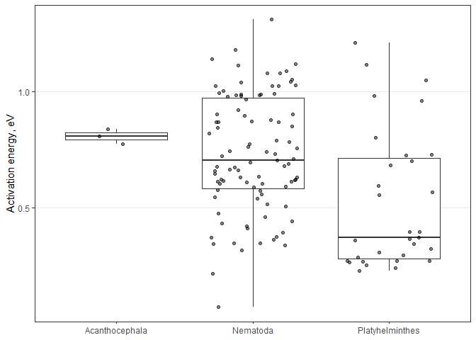
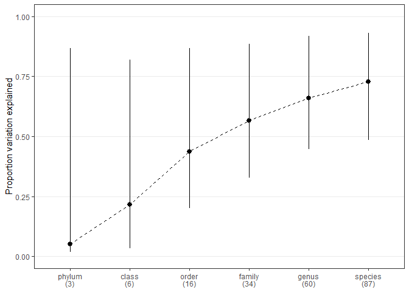
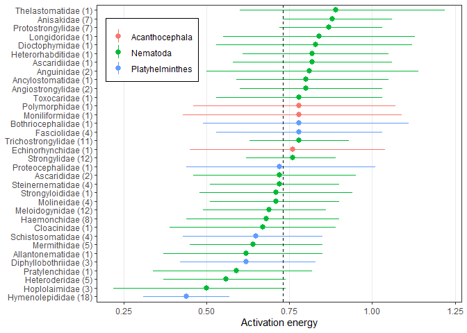
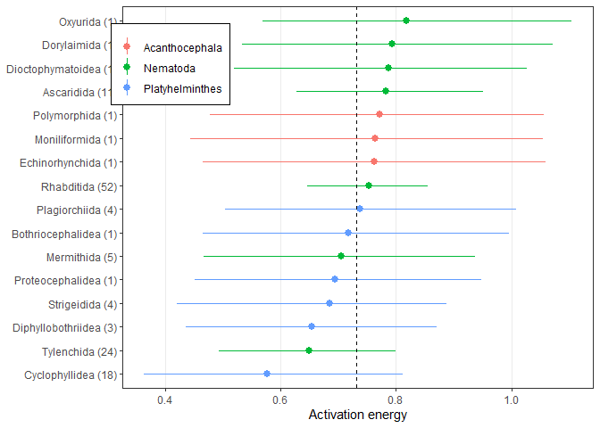
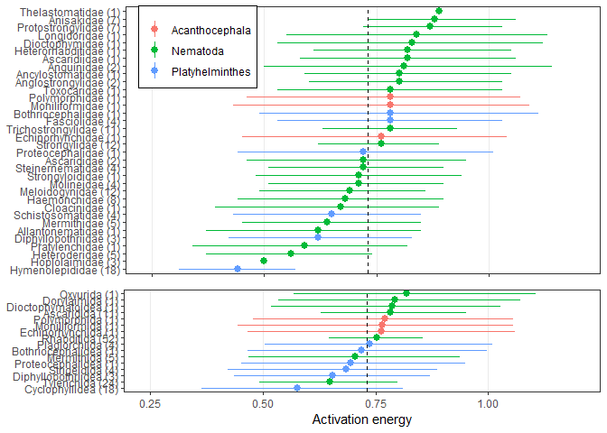

Taxonomic predictions
================

Number of AE estimates:

    ## [1] 129

Number of species:

    ## [1] 87

Here’s how many groups there are at each level of the taxonomy

| tax\_level |   n |
|:-----------|----:|
| binomial   |  87 |
| genus      |  60 |
| fam        |  34 |
| order      |  16 |
| class      |   6 |
| phylum     |   3 |

Here is AE separated by phylum

<!-- -->

Fit series models from the root to the the tip of taxonomy, i.e. first
phylum, then add order, then class, etc. Taxonomy is a random effect and
there are no fixed effects.

From these models, we calculate the variance explained by each new
taxonomic level.

And then plot them to see how each taxonomic level explains additional
variation in AE

<!-- -->

It looks like orders and families are most important.

    ## 
    ##  Iterations = 3001:102951
    ##  Thinning interval  = 50
    ##  Sample size  = 2000 
    ## 
    ##  DIC: -36.33155 
    ## 
    ##  G-structure:  ~binomial
    ## 
    ##          post.mean  l-95% CI u-95% CI eff.samp
    ## binomial  0.009782 0.0002975  0.02405     1366
    ## 
    ##                ~genus
    ## 
    ##       post.mean  l-95% CI u-95% CI eff.samp
    ## genus   0.01123 0.0002103  0.02733     1399
    ## 
    ##                ~fam
    ## 
    ##     post.mean  l-95% CI u-95% CI eff.samp
    ## fam    0.0169 0.0003084  0.04135     1579
    ## 
    ##                ~order
    ## 
    ##       post.mean  l-95% CI u-95% CI eff.samp
    ## order   0.01372 0.0003089  0.04412     2000
    ## 
    ##                ~class
    ## 
    ##       post.mean  l-95% CI u-95% CI eff.samp
    ## class   0.01079 0.0001724  0.04057     1665
    ## 
    ##                ~phylum
    ## 
    ##        post.mean l-95% CI u-95% CI eff.samp
    ## phylum     0.125 0.000172     0.16     2000
    ## 
    ##                ~idh(se_comb):units
    ## 
    ##               post.mean l-95% CI u-95% CI eff.samp
    ## se_comb.units         1        1        1        0
    ## 
    ##  R-structure:  ~units
    ## 
    ##       post.mean l-95% CI u-95% CI eff.samp
    ## units   0.03111  0.02008  0.04352     2000
    ## 
    ##  Location effects: E_comb ~ 1 
    ## 
    ##             post.mean l-95% CI u-95% CI eff.samp pMCMC   
    ## (Intercept)    0.7358   0.4932   1.0186     2000 0.004 **
    ## ---
    ## Signif. codes:  0 '***' 0.001 '**' 0.01 '*' 0.05 '.' 0.1 ' ' 1

Here is the percent variation explained by each taxonomic level in the
full model. Family is most important.

| level  |       lwr |       fit |       upr |
|:-------|----------:|----------:|----------:|
| phylum | 0.0062667 | 0.0734846 | 0.7674392 |
| class  | 0.0037993 | 0.0422026 | 0.3730201 |
| order  | 0.0055667 | 0.0800299 | 0.4116893 |
| family | 0.0087647 | 0.1351493 | 0.3974655 |
| genus  | 0.0056593 | 0.0856771 | 0.3085390 |

Here are predicted values for families (genus and within-species effects
marginalized)

| fam                |   n |  fit | fit.lwr | fit.upr | sd\_fit |
|:-------------------|----:|-----:|--------:|--------:|--------:|
| Hymenolepididae    |  18 | 0.44 |    0.31 |    0.57 |   0.000 |
| Meloidogynidae     |  12 | 0.69 |    0.49 |    0.86 |   0.000 |
| Strongylidae       |  12 | 0.76 |    0.62 |    0.89 |   0.001 |
| Trichostrongylidae |  11 | 0.78 |    0.63 |    0.93 |   0.003 |
| Haemonchidae       |   8 | 0.68 |    0.44 |    0.90 |   0.022 |
| Protostrongylidae  |   7 | 0.87 |    0.72 |    1.03 |   0.000 |
| Anisakidae         |   7 | 0.88 |    0.73 |    1.06 |   0.000 |
| Heteroderidae      |   5 | 0.56 |    0.37 |    0.74 |   0.000 |
| Mermithidae        |   5 | 0.64 |    0.45 |    0.85 |   0.004 |
| Schistosomatidae   |   4 | 0.65 |    0.43 |    0.85 |   0.000 |
| Molineidae         |   4 | 0.71 |    0.51 |    0.90 |   0.011 |
| Steinernematidae   |   4 | 0.72 |    0.51 |    0.90 |   0.001 |
| Fasciolidae        |   4 | 0.78 |    0.53 |    1.03 |   0.000 |
| Hoplolaimidae      |   3 | 0.50 |    0.22 |    0.74 |   0.001 |
| Diphyllobothriidae |   3 | 0.62 |    0.42 |    0.83 |   0.000 |
| Ascarididae        |   2 | 0.72 |    0.46 |    0.95 |   0.000 |
| Angiostrongylidae  |   2 | 0.80 |    0.60 |    1.03 |   0.000 |
| Anguinidae         |   2 | 0.81 |    0.50 |    1.14 |   0.014 |
| Pratylenchidae     |   1 | 0.59 |    0.34 |    0.82 |      NA |
| Allantonematidae   |   1 | 0.62 |    0.37 |    0.85 |      NA |
| Cloacinidae        |   1 | 0.67 |    0.39 |    0.89 |      NA |
| Strongyloididae    |   1 | 0.71 |    0.48 |    0.94 |      NA |
| Proteocephalidae   |   1 | 0.72 |    0.44 |    1.01 |      NA |
| Echinorhynchidae   |   1 | 0.76 |    0.45 |    1.04 |      NA |
| Bothriocephalidae  |   1 | 0.78 |    0.49 |    1.11 |      NA |
| Moniliformidae     |   1 | 0.78 |    0.43 |    1.09 |      NA |
| Polymorphidae      |   1 | 0.78 |    0.46 |    1.07 |      NA |
| Toxocaridae        |   1 | 0.78 |    0.53 |    1.03 |      NA |
| Ancylostomatidae   |   1 | 0.80 |    0.59 |    1.05 |      NA |
| Ascaridiidae       |   1 | 0.82 |    0.58 |    1.06 |      NA |
| Heterorhabditidae  |   1 | 0.82 |    0.61 |    1.05 |      NA |
| Dioctophymidae     |   1 | 0.83 |    0.53 |    1.12 |      NA |
| Longidoridae       |   1 | 0.84 |    0.55 |    1.13 |      NA |
| Thelastomatidae    |   1 | 0.89 |    0.60 |    1.22 |      NA |

<!-- -->

Here are predicted values for orders (family, genus and within-species
effects marginalized)

<!-- -->

<!-- -->
